# Maquina AguaDeMayo - DockerLabs.es

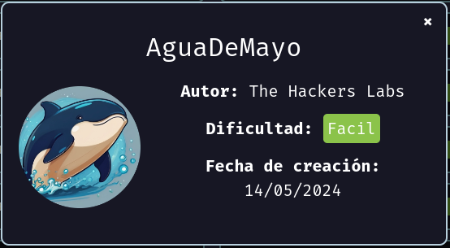

Verificar que la maquina este desplegada correctamente

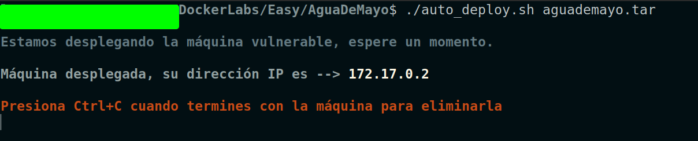

Realizamos un ping a la máquina para verificar la comunicación y confirmamos que la conexión es exitosa.

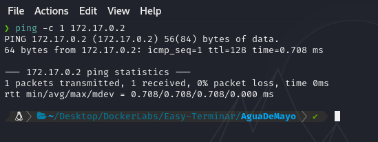

A continuación, realizamos un escaneo de la IP utilizando Nmap.

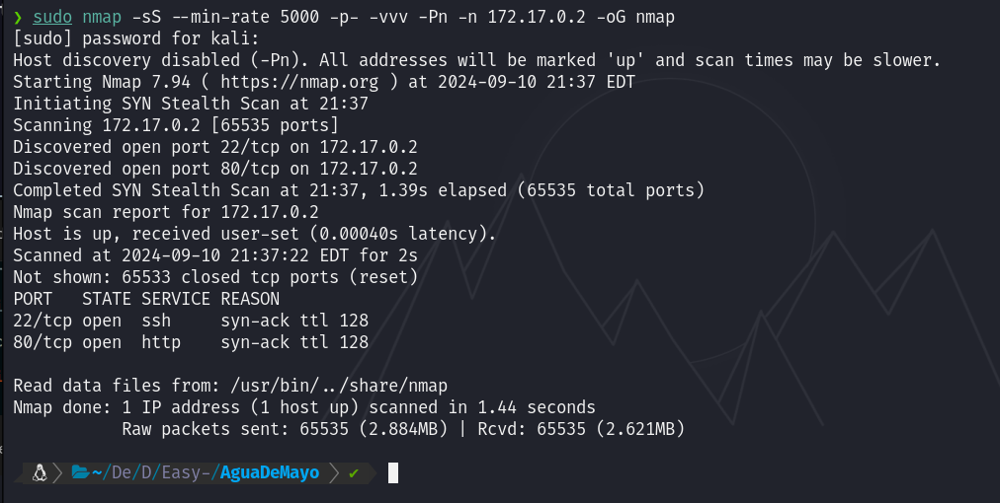

Observamos que el puerto 22 y 80 estan abiertos. Ahora realizamos un escaneo adicional para detectar, enumerar servicios y versiones.

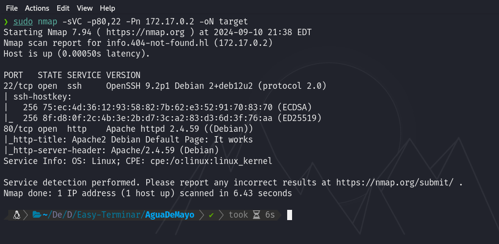

En este caso, nos centraremos en el puerto 80, que ejecuta un servicio HTTP mediante Apache httpd 2.4.59. Accederemos a la página web alojada en esta máquina utilizando un navegador.

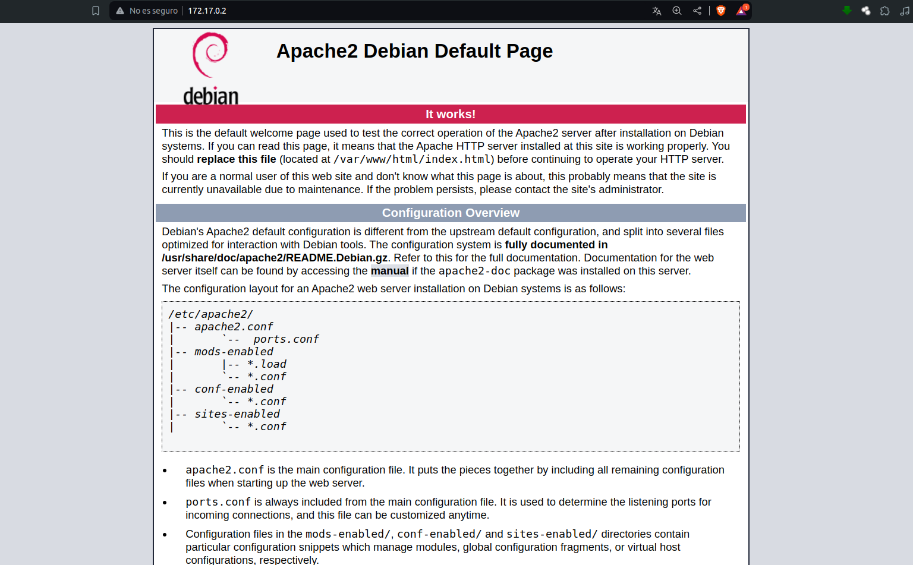

Actualmente, observamos que estamos en la página por defecto de Apache.

A continuación, procederemos a realizar un análisis de fuzzing para identificar posibles vulnerabilidades o información relevante. Durante este proceso, hemos descubierto una ruta donde se encuentran alojadas las imágenes.

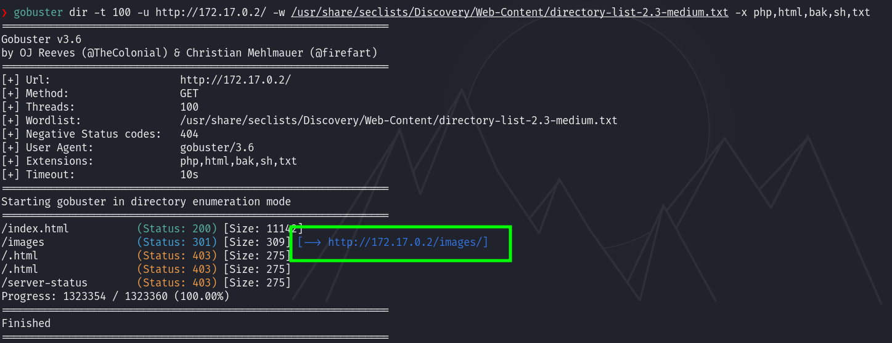

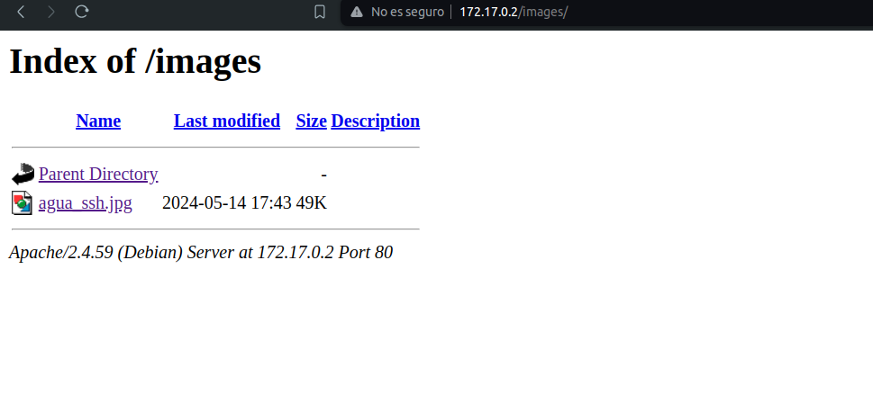

Hemos encontrado una imagen denominada agua_ssh.jpg. Al abrirla, observamos lo siguiente:

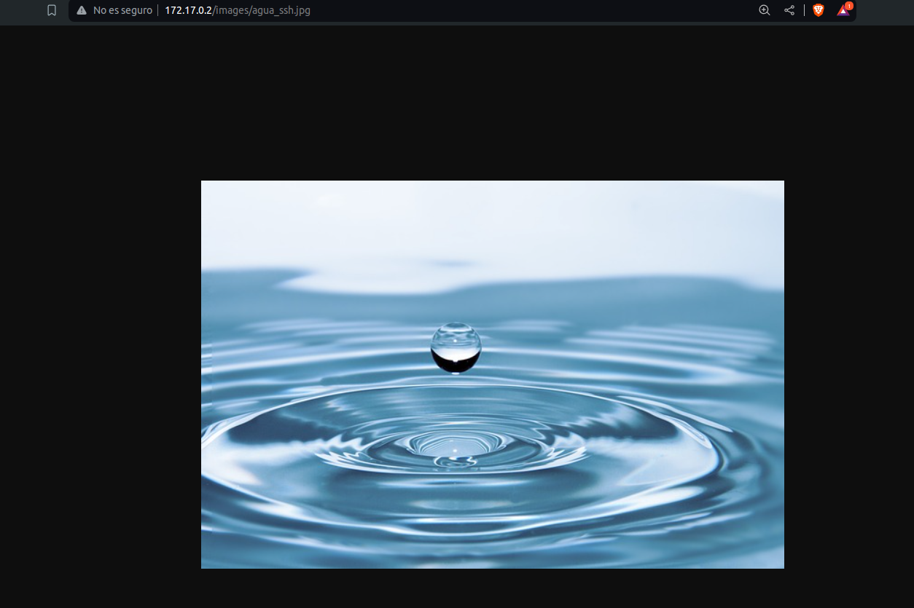

Si descargamos la imagen y examinamos sus metadatos, así como aplicamos técnicas de esteganografía para buscar información oculta, adelantamos que no encontraremos datos relevantes.

Sin embargo, al observar detenidamente el nombre de la imagen, agua_ssh.jpg, surge una posible pista. El nombre sugiere que podríamos utilizar la palabra "agua" para intentar una conexión SSH.

Dado que el puerto 22 está abierto y el servicio SSH está en funcionamiento, podríamos realizar un ataque de fuerza bruta usando Hydra con el usuario agua. Es posible que, al probar tu diccionario, no encuentres una contraseña válida.

Regresando a la página principal y revisando el código fuente, al hacer scroll hasta el final, observamos lo siguiente:

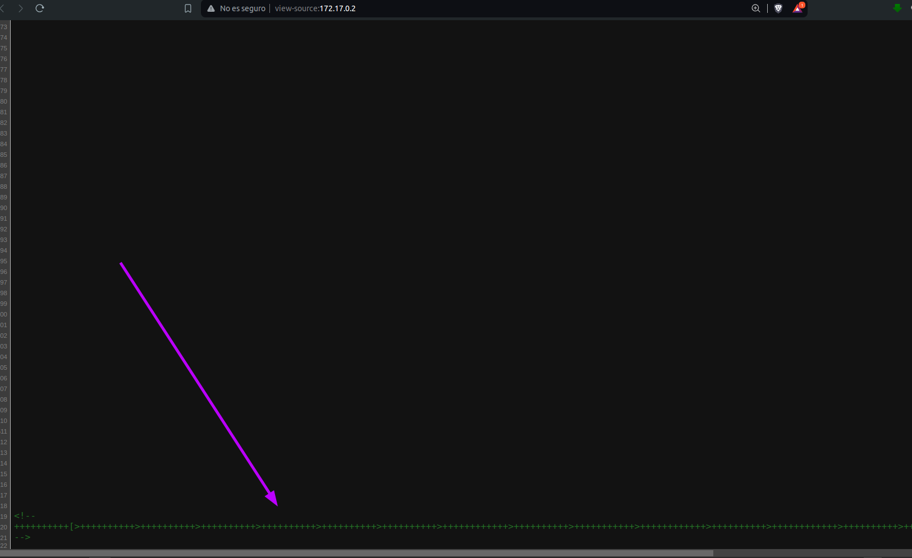

Si realizamos una breve investigación sobre esto,

`++++++++++[>++++++++++>++++++++++>++++++++++>++++++++++>++++++++++>++++++++++>++++++++++++>++++++++++>+++++++++++>++++++++++++>++++++++++>++++++++++++>++++++++++>+++++++++++>+++++++++++>+>+<<<<<<<<<<<<<<<<<-]>--.>+.>--.>+.>---.>+++.>---.>---.>+++.>---.>+..>-----..>---.>.>+.>+++.>.`

Descubriremos que el código corresponde a un lenguaje de programación llamado Brainfuck. Al buscar una herramienta en línea para decodificar este lenguaje, el resultado es `bebeaguaqueessano`.

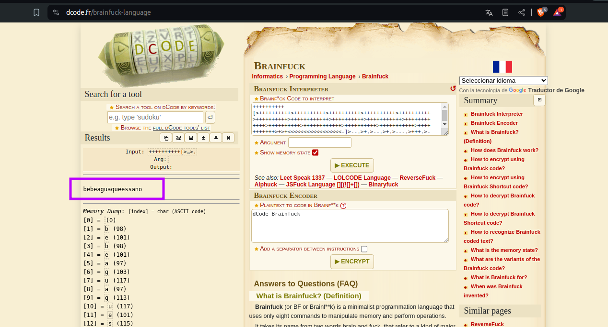

A continuación, intentaremos conectarnos por SSH utilizando el nombre de usuario agua y la contraseña bebeaguaqueessano. Al hacerlo, verificamos que hemos obtenido acceso con éxito.

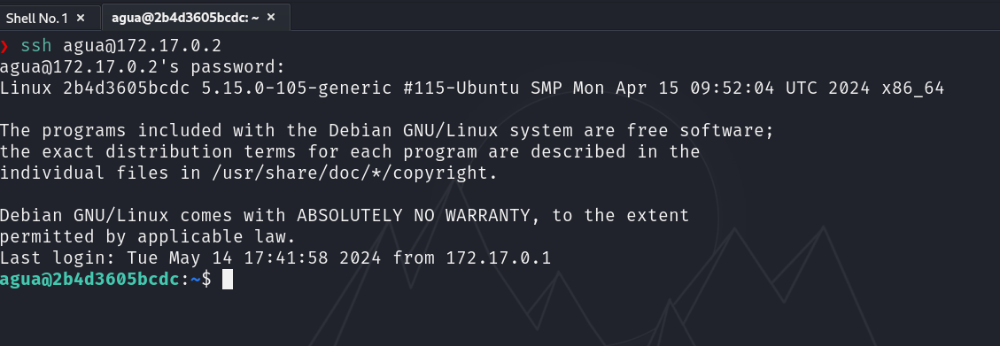

## Escalada de Privilegios

Al ejecutar sudo -l, observamos que tenemos permiso para ejecutar el binario /usr/bin/bettercap como usuario root sin necesidad de proporcionar una contraseña.

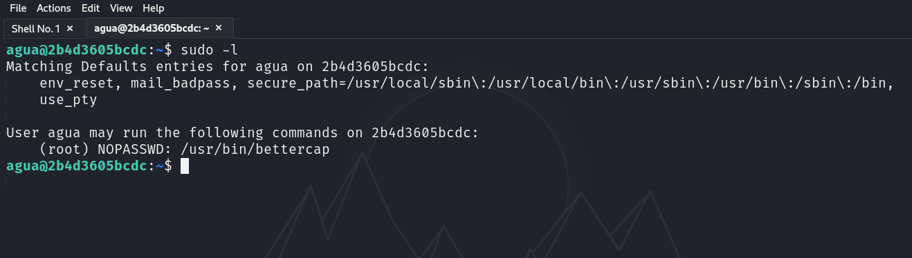

Al ejecutar sudo /usr/bin/bettercap y, posteriormente, ingresar el comando help en el prompt que aparece, obtendremos una lista de los comandos disponibles en la herramienta.

Notaremos que podemos ejecutar comandos del sistema utilizando el signo ! en el prompt.

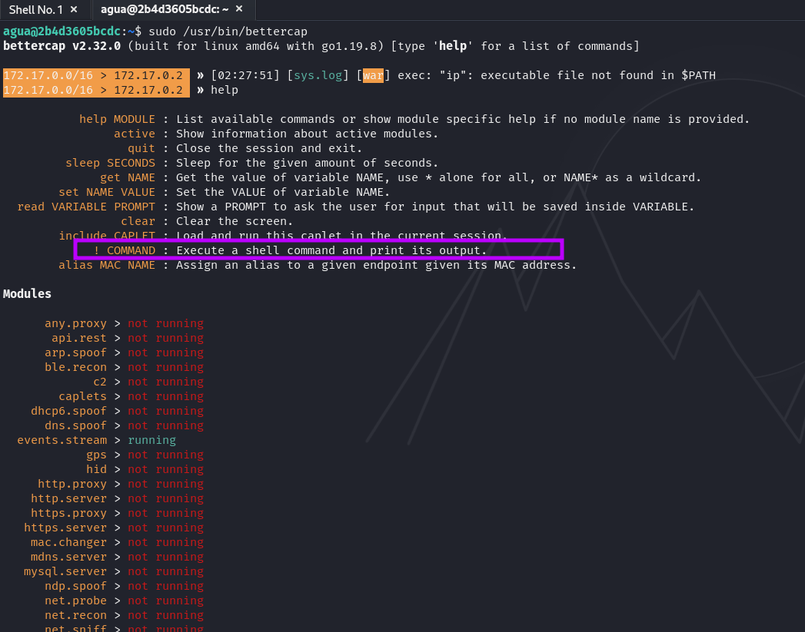

A continuación, podemos aprovechar esta capacidad para agregar permisos SUID a algún binario, entre otras acciones, para dejar una puerta abierta y escalar privilegios.

En mi caso, asignaré permisos SUID a bash utilizando el siguiente comando: `!chmod +s /bin/bash`.

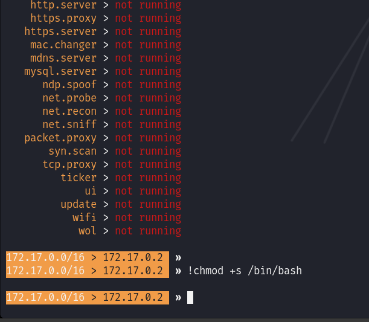

Después de salir del prompt de bettercap, si ejecutamos `ls -l` en el binario de `/bin/bash`, veremos que ahora tiene el permiso SUID asignado.

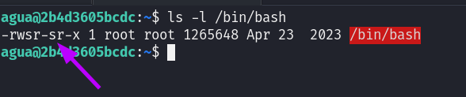

Ahora podemos explotar este permiso ejecutando `/bin/bash -p`. Con el permiso SUID configurado, esto nos proporcionará una sesión de bash con privilegios de root.

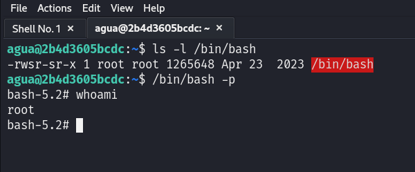
