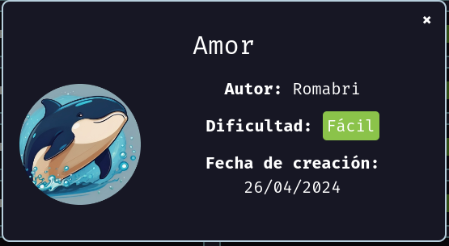

# Maquina Amor - DockerLabs.es

Verificar que la maquina este desplegada correctamente

<!-- ![[Pasted image 20240827225811.png]] -->

Realizamos un ping a la máquina para verificar la comunicación y confirmamos que la conexión es exitosa.

<!-- ![[Pasted image 20240827225914.png]] -->

A continuación, realizamos un escaneo de la IP utilizando Nmap.

<!-- ![[Pasted image 20240827225952.png]] -->

Observamos que el puerto 22 y 80 está abierto. Ahora realizamos un escaneo adicional para detectar, enumerar servicios y versiones.

<!-- ![[Pasted image 20240827230031.png]] -->

En este caso, nos centraremos en el puerto 80, que ejecuta un servicio HTTP mediante **Apache httpd 2.4.58**. Accederemos a la página web alojada en esta máquina utilizando un navegador.

<!-- ![[Pasted image 20240827231630.png]] -->

Al ingresar a la página web, observamos varios mensajes y párrafos. En uno de ellos se menciona que _**Juan**_ fue despedido por haber compartido su contraseña con un compañero. Además, se señala que alguien llamado _**Carlota**_, del departamento de ciberseguridad, firmó el documento.

Estos dos nombres podrían representar posibles usuarios con los que podríamos interactuar. Procederemos a realizar un ataque de fuerza bruta utilizando Hydra a través del servicio SSH con el usuario "carlota" para ver si conseguimos éxito.

<!-- ![[Pasted image 20240827232038.png]] -->

Hemos descubierto que la contraseña para el usuario `carlota` es `babygirl`. Ahora procederemos a acceder al sistema mediante SSH utilizando este usuario.

<!-- ![[Pasted image 20240827232205.png]] -->

Hemos accedido exitosamente al sistema. Ahora podemos ejecutar el comando `bash` para iniciar una sesión de bash, lo que nos permitirá trabajar de manera más cómoda.

<!-- ![[Pasted image 20240827232321.png]] -->

## Escalada de Privilegios

Si investigamos más a fondo, encontraremos en el directorio actual de trabajo del usuario `carlota` una carpeta llamada `Desktop`. Al seguir explorando, llegaremos a una imagen en la siguiente ruta: `/home/carlota/Desktop/fotos/vacaciones/imagen.jpg`.

<!-- ![[Pasted image 20240827232546.png]] -->

Procederemos a descargar la imagen a nuestra máquina atacante. Observamos que `python3` está instalado en la máquina víctima. Podemos compartir la imagen levantando un servidor HTTP en el directorio de trabajo `/home/carlota/Desktop/fotos/vacaciones/` utilizando el siguiente comando:
`python3 -m http.server 8080`

Esto nos permitirá acceder a la imagen a través de un navegador web desde nuestra máquina atacante.

<!-- ![[Pasted image 20240827232856.png]] -->

Desde nuestra máquina atacante, descargaremos la imagen utilizando `wget`. Para hacerlo, abrimos una terminal y ejecutamos el siguiente comando, sustituyendo `IP_DE_LA_VICTIMA` por la dirección IP de la máquina víctima:

`wget http://IP_DE_LA_VICTIMA:8080/imagen.jpg`

Esto descargará la imagen que compartimos desde el servidor HTTP levantado en la máquina víctima.

<!-- ![[Pasted image 20240827232951.png]] -->

Ahora que hemos descargado la imagen, intentaremos aplicar técnicas de esteganografía para extraer posibles datos ocultos. Utilizaremos la herramienta `steghide` para ello. Ejecutaremos el siguiente comando en nuestra máquina atacante:

`steghide extract -sf imagen.jpg`

Este comando nos pedirá la contraseña utilizada para ocultar los datos en la imagen. Si se proporciona la contraseña correcta, `steghide` extraerá los archivos ocultos en la imagen `imagen.jpg`. En este caso la contraseña la dejamos vacía.

<!-- ![[Pasted image 20240827233328.png]] -->

Después de extraer el archivo llamado `secret.txt`, revisaremos su contenido para identificar cualquier información interesante. Podemos hacerlo abriendo el archivo con un editor de texto o utilizando el siguiente comando en la terminal:
`cat secret.txt`

<!-- ![[Pasted image 20240827233417.png]] -->

Y vemos que tiene algo en base64 dentro, ahora lo decodificamos a ver que quiere decir eso y como vemos es un texto que dice `eslacasadepinypon`.

<!-- ![[Pasted image 20240827233509.png]] -->

Al revisar el archivo `/etc/passwd`, encontramos varios usuarios en el sistema, entre los cuales se destaca uno llamado `oscar`.

<!-- ![[Pasted image 20240827233710.png]] -->

Intentaremos cambiar del usuario `carlota` al usuario `oscar` y utilizaremos el texto encontrado anteriormente, `eslacasadepinypon`, como contraseña. Para ello, ejecutaremos el siguiente comando:

<!-- ![[Pasted image 20240827233827.png]] -->

Y vemos que ahora somos el usuario `oscar`!

Al explorar las carpetas en el directorio de trabajo del usuario `oscar`, encontramos una carpeta llamada `Desktop`. Dentro de `/home/oscar/Desktop`, localizamos un archivo llamado `IMPORTANTE.txt`.

<!-- ![[Pasted image 20240827234023.png]] -->

Y vemos el siguiente mensaje...

Si hacemos un `sudo -l`, notaremos lo siguiente

<!-- ![[Pasted image 20240827234112.png]] -->

Parece que podemos ejecutar `ruby` como root sin necesidad de proporcionar una contraseña. Consultando la página [GTFOBins](https://gtfobins.github.io/gtfobins/ruby/#sudo), encontramos una forma de explotar esta capacidad.

Podemos aprovechar esta vulnerabilidad para obtener una shell con privilegios de root utilizando el siguiente comando:

`sudo /usr/bin/ruby -e 'exec "/bin/bash"'`

<!-- ![[Pasted image 20240827234313.png]] -->

¡Hemos logrado obtener una shell con privilegios de root!
