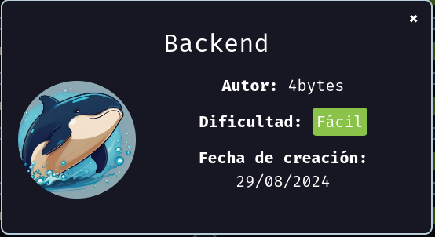

# Maquina Backend - DockerLabs.es

Verificar que la maquina este desplegada correctamente

<!-- ![[Pasted image 20240830142952.png]] -->

Realizamos un ping a la máquina para verificar la comunicación y confirmamos que la conexión es exitosa.

<!-- ![[Pasted image 20240830143122.png]] -->

A continuación, realizamos un escaneo de la IP utilizando Nmap.

<!-- ![[Pasted image 20240830143217.png]] -->

Observamos que el puerto 22 y 80 está abierto. Ahora realizamos un escaneo adicional para detectar, enumerar servicios y versiones.

<!-- ![[Pasted image 20240830143243.png]] -->

En este caso, nos centraremos en el puerto 80, que ejecuta un servicio HTTP mediante \*\*Apache httpd 2.4.61. Accederemos a la página web alojada en esta máquina utilizando un navegador.

<!-- ![[Pasted image 20240830143401.png]] -->

Al hacer clic en el botón de "Login", seremos redirigidos a una página donde encontraremos el formulario de acceso.

<!-- ![[Pasted image 20240830143512.png]] -->

Podemos intentar ataques de fuerza bruta, aunque es probable que no sean efectivos. En su lugar, podríamos considerar un ataque de "SQL Injection" (SQLI). Comenzaremos probando con una comilla simple para observar cómo responde el sistema.

<!-- ![[Pasted image 20240830143720.png]] -->

Observamos que el sistema devuelve un error indicando un problema de sintaxis en la consulta SQL. Esto sugiere que la aplicación es vulnerable a ataques de SQL Injection (SQLI).

<!-- ![[Pasted image 20240830143807.png]] -->

Ahora abriremos Burp Suite e intentaremos iniciar sesión en la página web con cualquier credencial de nuestra elección. Capturaremos la solicitud generada y la guardaremos en un archivo para su lectura posterior con `sqlmap`.

<!-- ![[Pasted image 20240830144127.png]] -->

En mi caso lo guardare en uno llamado `req.txt`

<!-- ![[Pasted image 20240830144552.png]] -->

Ahora utilizaremos `sqlmap` para explotar la vulnerabilidad de SQL Injection de manera más eficiente. Ejecutaremos el siguiente comando:

`sqlmap -r req.txt -p username --dbs`

- `-r`: Indica que vamos a importar un archivo que contiene la solicitud capturada desde Burp Suite.
- `-p`: Especifica el parámetro en el que queremos inyectar los payloads (en este caso, "username").
- `--dbs`: Solicita que se extraigan los nombres de las bases de datos disponibles.

Al ejecutar este comando, veremos un listado de las bases de datos disponibles en el sistema.

<!-- ![[Pasted image 20240830145008.png]] -->

Vemos que una de las bases de datos de interés es "users". Ahora procederemos a extraer los nombres de las tablas dentro de esa base de datos utilizando `sqlmap`. Ejecutaremos el siguiente comando:

`sqlmap -r req.txt -p username -D users --tables`

- `-D`: Especifica el nombre de la base de datos con la que queremos interactuar (en este caso, "users").
- `--tables`: Indica que queremos extraer los nombres de las tablas dentro de la base de datos especificada.

Esto nos proporcionará una lista de las tablas contenidas en la base de datos "users".

<!-- ![[Pasted image 20240830145244.png]] -->

Ahora que hemos identificado una tabla llamada `usuarios`, el siguiente paso es extraer los nombres de las columnas y obtener un volcado de los datos. Ejecutaremos el siguiente comando:

`sqlmap -r req.txt -p username -D users -T usuarios --columns --dump`

- `-T`: Especifica la tabla con la que queremos interactuar (en este caso, `usuarios`).
- `--columns`: Solicita que se extraigan los nombres de las columnas de la tabla.
- `--dump`: Realiza un volcado de los datos de la tabla para visualizar y descargar la información.

Esto nos proporcionará tanto los nombres de las columnas como el contenido de la tabla `usuarios`.

<!-- ![[Pasted image 20240830145545.png]] -->

Y como podemos ver ya tenemos algunas credenciales que podemos llegar a utilizar mas adelante.

Ahora moveré esos datos a mi directorio actual de trabajo y le cambiare el nombre a la carpeta.

<!-- ![[Pasted image 20240830145733.png]] -->

<!-- ![[Pasted image 20240830145817.png]] -->

Ahora, al usar el comando `cat` en el archivo de registro dentro de esa carpeta, podrás revisar los comandos ejecutados y los datos extraídos. Esto te permitirá tener un recordatorio de las credenciales obtenidas.

<!-- ![[Pasted image 20240830145937.png]] -->

<!-- ![[Pasted image 20240830145946.png]] -->

A continuación, crearemos un archivo llamado `passwords.txt` para almacenar las contraseñas encontradas. En este archivo, recopilaremos y guardaremos todas las contraseñas de los usuarios extraídas.

<!-- ![[Pasted image 20240830150220.png]] -->

Recordemos que durante el escaneo detectamos que el puerto 22 está abierto y ejecutando un servicio SSH. Procederemos a realizar un ataque de fuerza bruta utilizando Hydra para intentar acceder por SSH con cada uno de los usuarios encontrados, empleando la lista de contraseñas que guardamos en el archivo `passwords.txt`.

Después de ejecutar el ataque, logramos obtener acceso exitoso con el usuario `pepe`.

<!-- ![[Pasted image 20240830150456.png]] -->

Ahora ingresaremos con dicho usuario por SSH.

<!-- ![[Pasted image 20240830150529.png]] -->

Si realizamos una búsqueda de binarios con permisos SUID y SGID, encontraremos algunos que llaman la atención, tales como:

`/usr/bin/grep` y `/usr/bin/ls`

<!-- ![[Pasted image 20240830150712.png]] -->

Ahora, al ejecutar `ls -la` dentro de la carpeta, veremos los archivos y permisos de esa ubicación. Notaremos que hay un archivo llamado `pass.hash`.

<!-- ![[Pasted image 20240830150822.png]] -->

Ahora, al usar el comando `grep` de manera adecuada para leer el archivo, encontraremos un hash dentro de `pass.hash`.

<!-- ![[Pasted image 20240830151004.png]] -->

Ahora, copia el hash del archivo y pégalo en una página de descifrado de contraseñas, como [CrackStation](https://crackstation.net/). Al descifrarlo, obtendrás un resultado que indica `spongebob34`, lo cual podría ser una contraseña.

<!-- ![[Pasted image 20240830151104.png]] -->

Si intentamos iniciar sesión como "root" utilizando la contraseña `spongebob34`, podremos acceder al sistema en modo "root".

<!-- ![[Pasted image 20240830151240.png]] -->

