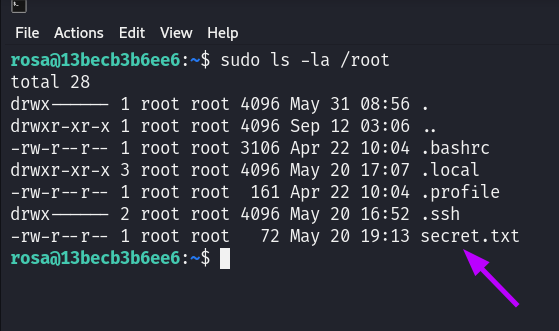

# Maquina AnonymousPingu - DockerLabs.es

Verificar que la maquina este desplegada correctamente

Realizamos un ping a la máquina para verificar la comunicación y confirmamos que la conexión es exitosa.

A continuación, realizamos un escaneo de la IP utilizando Nmap.

Observamos que el puerto 22 y 80 estan abiertos. Ahora realizamos un escaneo adicional para detectar, enumerar servicios y versiones.

Hemos identificado que el puerto 22 está ejecutando un servicio SSH, mientras que el puerto 80 está albergando un servidor Apache 2.4.58.

Enfoquémonos en el puerto 80. Al acceder a este puerto a través del navegador, observaremos lo siguiente:

Al aplicar técnicas de fuzzing, es posible descubrir rutas como wordpress.

Si accedemos a esa ruta desde el navegador, veremos lo siguiente:

Al aplicar técnicas de fuzzing sobre esa ruta, encontraremos un archivo `index.php`.

Estuve buscando posibles vulnerabilidades sin encontrar nada relevante inicialmente. Posteriormente, intenté aplicar técnicas de fuzzing en el archivo `index.php`, probando comandos como `whoami` e insertando palabras con herramientas para hacer Fuzzing en diversos parámetros que podría aceptar el archivo, pero sin éxito.

Finalmente, al aplicar un ataque de Directory Path Traversal, y Fuzzing en parametros del archivo `index.php` logre tener exito y encontrar el parametro `love`

Luego, intenté leer el archivo `/etc/passwd` en busca de usuarios y descubrí que había dos usuarios registrados: `pedro` y `rosa`.

Dado que la máquina tiene el puerto 22 abierto con un servicio SSH en ejecución, decidimos intentar un ataque de fuerza bruta utilizando Hydra. Después de realizar el ataque, logramos encontrar la contraseña para el usuario `rosa`, que resultó ser `lovebug`.

Procederemos a conectar por SSH al usuario `rosa` utilizando las credenciales obtenidas.

Y ya estamos dentro.

## Escalada de Privilegios

Al ejecutar el comando `sudo -l`, podemos ver que tenemos permisos para ejecutar los binarios `ls` y `cat` como root sin necesidad de proporcionar una contraseña.

Al ejecutar el comando `sudo ls -la /root`, descubriremos que dentro del directorio `/root` hay un archivo llamado `secret.txt`.

Aprovechando los permisos del binario `cat`, podemos leer el contenido del archivo `secret.txt` con el siguiente comando: `sudo cat /root/secret.txt`. El contenido del archivo es el siguiente:

El contenido del archivo `secret.txt` está representado en caracteres hexadecimales. Al convertir estos caracteres a texto legible, obtenemos la cadena `noacertaraosi`.

Podemos inferir que la cadena `noacertaraosi` podría ser una contraseña. Al intentar iniciar sesión con el usuario pedro utilizando esta contraseña, efectivamente obtenemos acceso.

Al ejecutar `sudo -l` con el usuario pedro, observamos que tenemos permisos para ejecutar el binario `/usr/bin/env` como root sin necesidad de proporcionar una contraseña.

Podemos explotar esta vulnerabilidad utilizando los permisos otorgados para el binario `/usr/bin/env`. Ejecutando el siguiente comando:

`sudo /usr/bin/env /bin/bash`

Obtendremos una shell con privilegios de root.

