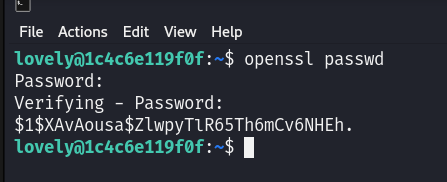

# Maquina ConsoleLog - DockerLabs.es

Verificar que la maquina este desplegada correctamente

Realizamos un ping a la máquina para verificar la comunicación y confirmamos que la conexión es exitosa.

A continuación, realizamos un escaneo de la IP utilizando Nmap.

Observamos que el puerto 80, 3000 y 5000 estan abiertos. Ahora realizamos un escaneo adicional para detectar, enumerar servicios y versiones.

Observamos que el puerto 80 está utilizando el protocolo HTTP con el servicio Apache versión 2.4.61. El puerto 3000 también opera bajo el protocolo HTTP y está ejecutando un servicio de Node.js con Express. Por otro lado, el puerto 5000 está configurado para el protocolo SSH.

En primer lugar, nos enfocaremos en el puerto 80. Al acceder a este puerto desde un navegador, veremos lo siguiente:

En la página, observamos un título que dice "Bienvenido a mi sitio" y un botón que dice "Botón en fase beta".

Al hacer clic en este botón y revisar la consola del navegador, encontramos el siguiente mensaje: \*\*\*Para opcionVemos un titulo que dice "Bienvenido a mi sitio" y un boton que dice "Boton en fase beta"...

Si damos click en ese boton y vemos la consola del navegador veremos un mensaje que dice **_Para opciones de depuracion, el token de /recurso/ es tokentraviesito_**, si aplicamos Fuzzing a la web encontraremos algunas rutas interesantes como estas.es de depuración, el token de /recurso/ es tokentraviesito\*\*\*.

Si aplicamos técnicas de Fuzzing en el sitio web, descubriremos algunas rutas interesantes, como las siguientes:

Si entramos a dicha ruta veremos lo siguiente:

Al acceder al archivo server.js, podremos ver el código fuente de dicho archivo.

El archivo que estamos viendo en resumen es un servidor montado con Express y tiene definido un endpoint que permite solicitudes utilizando el metodo POST a una ruta llamada `/recurso/` y basicamente si enviamos en el `body` de la peticion un campo llamado `token` y le ponemos el valor de `tokentraviesito` el servidor nos respondera con un mensaje que dice `lapassworddebackupmaschingonadetodas`... Observamos que hay una variable llamada port, que está configurada con el valor 3000, indicando el puerto en el que el servidor está escuchando. Por eso, el puerto 3000 apareció como abierto durante nuestro escaneo.

Ahora bien, podemos enviar una solicitud POST con el campo de `token` y en valor enviara `tokentraviesito` para recibir el mensaje, pero como ya lo estamos viendo directamente lo que el servidor nos responderá, no veo ninguna necesidad de seguirlo... Solamente copiamos la respuesta que es `lapassworddebackupmaschingonadetodas`, recordemos que el puerto 5000 corre SSH, ahora podemos intentar hacer ataques de fuerza bruta con Hydra utilizando dicha posible contraseña y una lista de posibles usuarios para ver si logramos tener acceso...

Y vemos que logramos dar con credenciales validas.

Ahora que hemos obtenido las credenciales válidas, ingresamos a la máquina víctima a través de SSH, lo que nos permite tener acceso al sistema.

## Escalada de Privilegios

Al ejecutar el comando `sudo -l`, observamos que podemos ejecutar el binario `/usr/bin/nano` como cualquier usuario sin necesidad de proporcionar una contraseña.

Generaremos un hash utilizando `openssl passwd` con la contraseña de nuestra elección; en este caso, usaré la contraseña `pwned`.

Una vez generado el hash, lo copiaremos para su uso posterior.

A continuación, abriremos el archivo `/etc/passwd` utilizando el comando `sudo /usr/bin/nano /etc/passwd`. Dentro del archivo, reemplazaremos el carácter x en la entrada correspondiente por el hash que generamos previamente.

El archivo `/etc/passwd` debería quedar de la siguiente manera después del reemplazo. Luego, guardamos los cambios y salimos del editor.

Ahora solo necesitamos ejecutar el comando `su root` e ingresar la contraseña que utilizamos para generar el hash, en mi caso pwned. Esto nos permitirá convertirnos en el usuario root.

