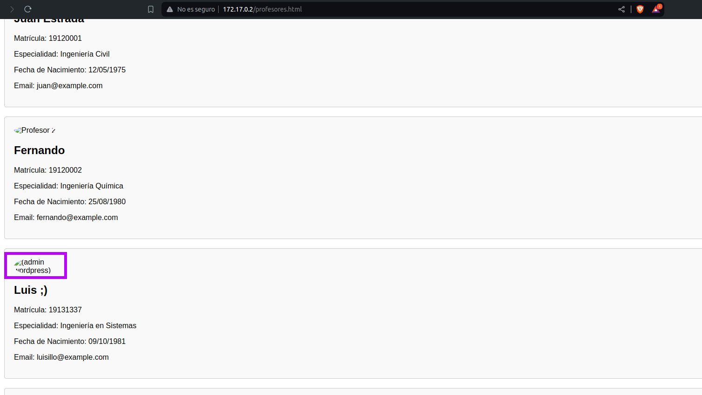

# Maquina Escolares - DockerLabs.es

Verificar que la maquina este desplegada correctamente

Realizamos un ping a la máquina para verificar la comunicación y confirmamos que la conexión es exitosa.

A continuación, realizamos un escaneo de la IP utilizando Nmap.

Observamos que el puerto 80 y 22 estan abiertos. Ahora realizamos un escaneo adicional para detectar, enumerar servicios y versiones.

En este caso, nos centraremos en el puerto 80 el unico que esta abierto y ejecuta un Apache. Accederemos a la página web alojada en esta máquina utilizando un navegador y veremos lo siguiente.

Al revisar el código fuente de la página, podemos encontrar un comentario que sugiere una posible ruta: `/profesores.html`.

Si accedemos a esa ruta, encontraremos una página que muestra una lista de profesores. Observamos que uno de ellos tiene un atributo alt en la imagen que contiene el texto `(admin wordpress)`.

Al aplicar técnicas de fuzzing en la dirección `http://172.17.0.2/`, descubrimos varias rutas, entre ellas `wordpress`. Al acceder a esta ruta, encontramos una página que parece estar montada con WordPress.

Al utilizar la herramienta wpscan con el comando `wpscan --url http://172.17.0.2/wordpress --enumerate u,vp`, podemos verificar la existencia de plugins vulnerables y enumerar los usuarios existentes.

En el proceso, encontramos un usuario llamado `luisillo`, que coincide con uno de los profesores que vimos anteriormente.

Ahora podemos intentar hacer ataques de fuerza bruta utilizando (**_ NO ejecutes los siguientes comandos_**) `wpscan --url http://172.17.0.2/wordpress -U luisillo -P /usr/share/wordlists/rockyou.txt`, pero quizas no tengamos exito ya que en el diccionario `rockyou.txt` no encontraremos una clave para podes inicar sesión...

En situaciones como esta, podemos utilizar una herramienta llamada `cupp` para generar diccionarios de contraseñas personalizados basados en la información que proporcionemos.

Para usar cupp, ejecutamos el comando `cupp -i`, que inicia una forma interactiva. La herramienta nos hará una serie de preguntas, y con base en nuestras respuestas, generará un diccionario de contraseñas.

En este caso, cupp generó un diccionario llamado `luis.txt`.

Ahora utilizaremos `wpscan --url http://172.17.0.2/wordpress -U luisillo -P luis.txt` pero pasandole la ruta del diccionario de datos que acabamos de generar utilizando `cupp`

Después de realizar el ataque de fuerza bruta utilizando el diccionario luis.txt, se identificaron credenciales válidas:

Usuario: luisillo
Contraseña: Luis1981

Con estas credenciales, es posible acceder al panel de administración de WordPress.

A continuación, procedemos a iniciar sesión utilizando las credenciales obtenidas. Una vez dentro del panel de administración de WordPress, nuestro objetivo es encontrar una forma de acceder al servidor.

Una estrategia para lograr esto es aprovechar un plugin instalado llamado `WP File Manager`. Este plugin permite gestionar los archivos del servidor directamente desde el panel de administración, lo que puede facilitarnos el acceso al sistema de archivos y, potencialmente, a otras áreas del servidor.

Este plugin nos permitira subir archivos, podemos subir un archivo malicioso en PHP que nos envie una shell inversa a nuestra maquina atacante de la siguiente manera

Primero createmos la shell inversa

Luego de haber subido el archivo malicioso, procedemos a navegar por la estructura de carpetas del servidor. Utilizando el navegador, exploraremos las rutas disponibles para localizar el archivo que hemos subido. Una vez encontrado, procederemos a ejecutar el archivo para establecer la conexión de shell inversa con nuestra máquina atacante.

Pero antes nos ponemos a la escucha con Netcat por el puerto 4444 utilizando `nc -nvlp 4444`

Una vez hecho lo anterior, ahora abrimos el archivo `pwned.php`

Y ya estariamos dentro.

## Tratamiento de la TTY

**Para trabajar de manera mas cómoda haremos lo siguiente:**
Una vez estemos dentro ejecutamos el siguiente comando: `script /dev/null -c bash`

Luego presionamos: `Ctrl + Z` para suspender el proceso

A continuación, escribimos: `stty raw -echo; fg`

Despues ingresamos: `reset`

Cuando se nos pregunte: "Terminal type?" Ingresamos `xterm`.

Finalmente, exportamos las siguientes variables de entorno: `export TERM=xterm` `export SHELL=bash`

Y listo!

## Escalada de Privilegios

Al realizar una búsqueda de archivos con la extensión .txt, encontramos dos archivos de interés:

`/tmp/.secret.txt` y
`/home/secret.txt`

Estos archivos podrían contener información relevante para nuestros objetivos.

Nos centraremos en el archivo `/home/secret.txt`. Al leer su contenido, encontramos una posible contraseña: `luisillopasswordsecret`. Esta información podría ser crucial para los siguientes pasos en nuestra investigación o explotación.

Al revisar la lista de usuarios en el sistema utilizando el siguiente comando:

`cat /etc/passwd | grep "sh$"`

Identificamos que existe un usuario llamado `luisillo`. Este usuario podría tener permisos o acceso relevante para nuestros objetivos.

Al intentar cambiar al usuario `luisillo` utilizando el comando `su luisillo` y proporcionar la contraseña `luisillopasswordsecret`, logramos acceder con éxito a la cuenta del usuario. Este acceso puede proporcionar más oportunidades para explorar y explotar el sistema.

Al ejecutar el comando `sudo -l` con el usuario `luisillo`, observamos que tenemos la capacidad de ejecutar el binario `/usr/bin/awk` como cualquier usuario sin necesidad de proporcionar una contraseña. Esta configuración puede permitirnos escalar privilegios o realizar otras acciones en el sistema.

Podemos aprovechar los permisos para ejecutar el binario /usr/bin/awk sin contraseña y escalar privilegios. Para ello, utilizamos el siguiente comando:

`sudo /usr/bin/awk 'BEGIN {system("/bin/bash")}'`

Este comando nos permite abrir una nueva sesión de bash con privilegios de superusuario. Al ejecutar este comando, confirmamos que ahora tenemos acceso con permisos de root.

