# Maquina HiddenCat - DockerLabs.es

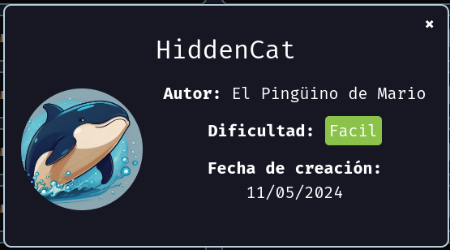

Verificar que la maquina este desplegada correctamente

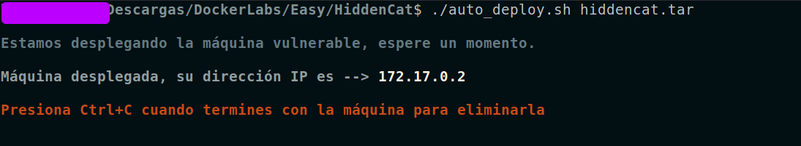

Realizamos un ping a la máquina para verificar la comunicación y confirmamos que la conexión es exitosa.

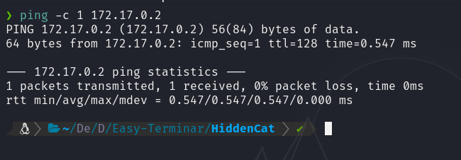

A continuación, realizamos un escaneo de la IP utilizando Nmap.

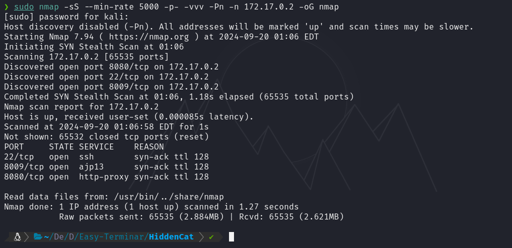

Observamos que el puerto 22,8009 y 8080 estan abiertos. Ahora realizamos un escaneo adicional para detectar, enumerar servicios y versiones.

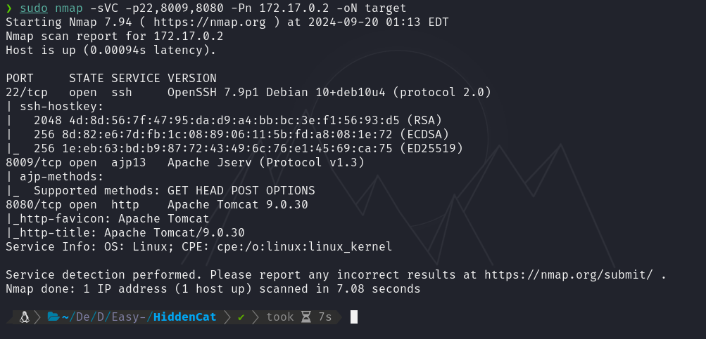

Observamos que se trata de Apache Tomcat 9.0.30, con el servicio AJP 1.3 (Apache JServ) ejecutándose en el puerto 8009.

Al realizar una búsqueda utilizando `searchsploit`, encontramos varios exploits que podrían ser aplicables en esta situación.

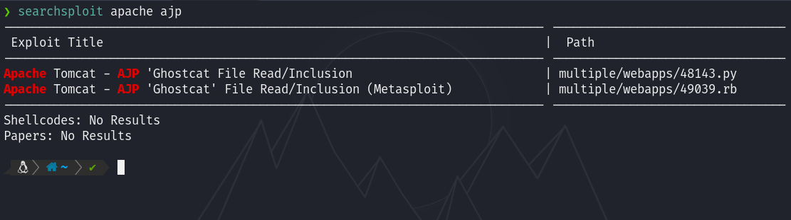

Ahora procederé a mover el exploit al directorio de trabajo actual utilizando el comando:
`searchsploit -m 48143`

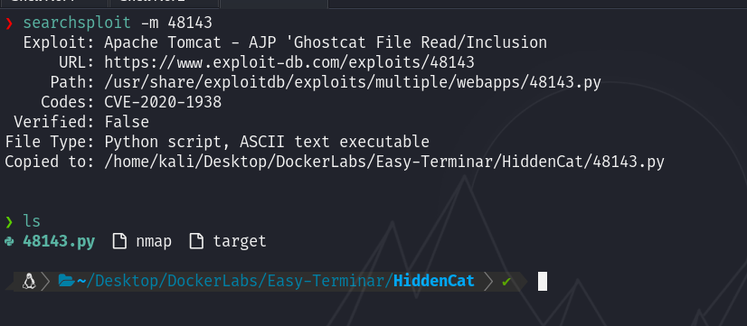

Al revisar el contenido del exploit, observamos que recibe algunos parámetros, mientras que otros están establecidos por defecto.

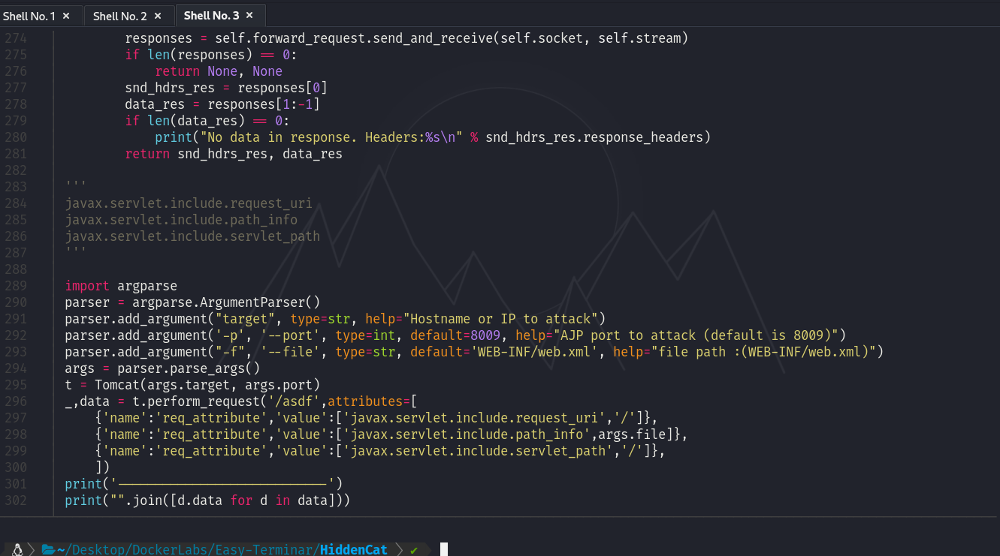

En este caso, verificamos que el puerto coincide con el del servicio, por lo que solo necesitaremos especificar el objetivo. Ejecutaremos el exploit de la siguiente manera:

`python2 48143.py 172.17.0.2`

A continuación, revisaremos el contenido del archivo WEB-INF/web.xml.

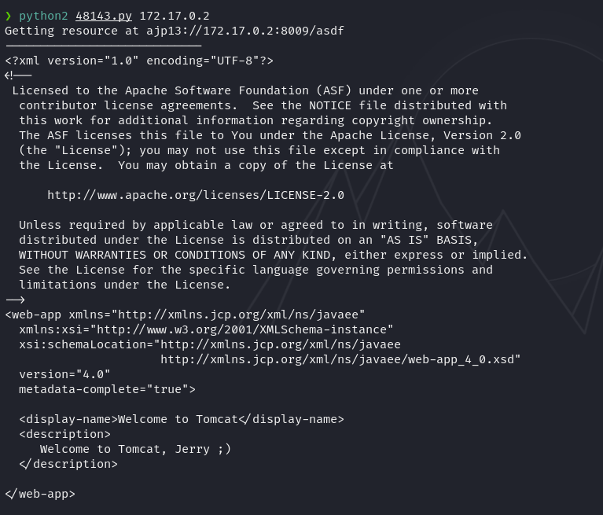

Si observamos bien hay un mensaje que dice `Welcome to Tomcat, Jerry ;)`, `jerry` podria ser un usuario potencial con el que podriamos intentar hacer cosas.

Si recordamos el puerto 22 esta abierto y ejecuta un SSH por detras. Si realizamos un ataque por fuerza bruta utilizando Hydra al servicio de SSH utilizando como usuario a `jerry` veremos que encontraremos la contraseña de dicho usuario

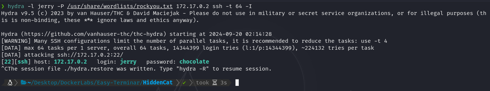

Ahora entraremos por SSH utilizando dichas credenciales.

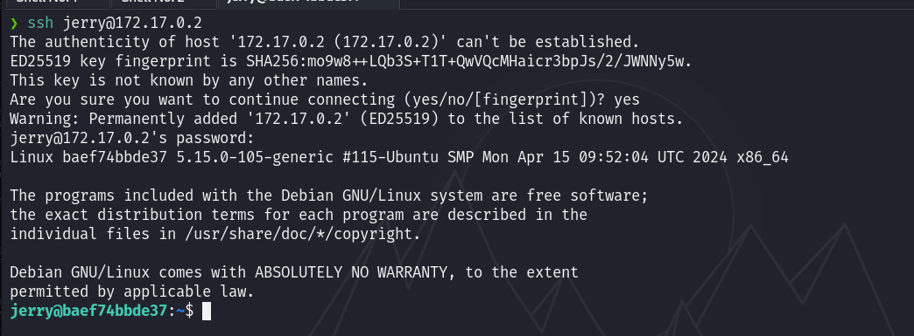

Y ya estariamos dentro.

## Escalda de Privilegios

Si hacemos una busqueda de binarios SUID y SGID encontraremos algunos que son bien interesantes como:
`/usr/bin/python3.7`
`/usr/bin/perl`
`/usr/bin/python3.7m`
`/usr/bin/perl5.28.1`

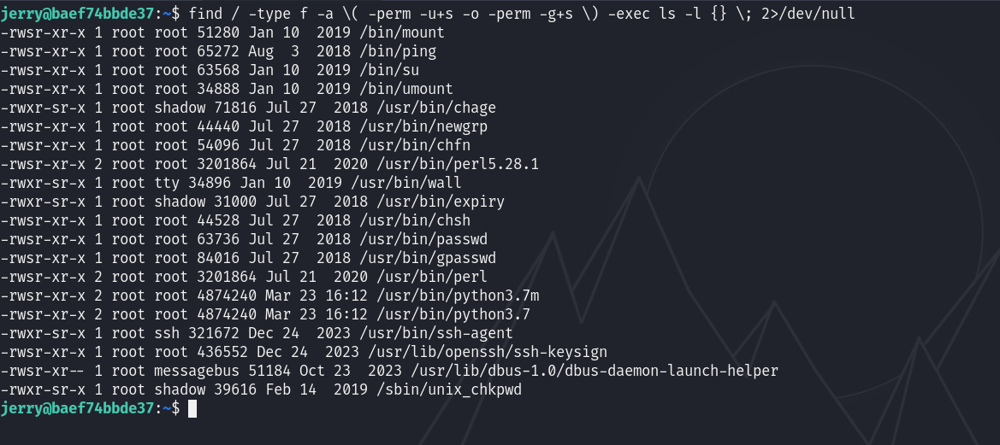

Podemos intentar escalar privilegios con alguno de estos, en mi caso lo haré utilizando `/usr/bin/python3.7` de la siguiente manera `/usr/bin/python3.7 -c 'import os; os.execl("/bin/sh", "sh", "-p")'`

Y veremos que ahora somos root

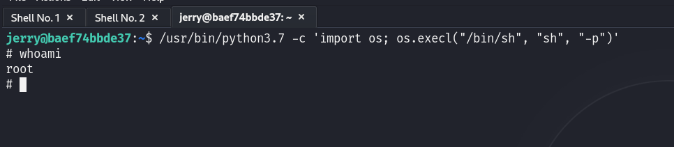
