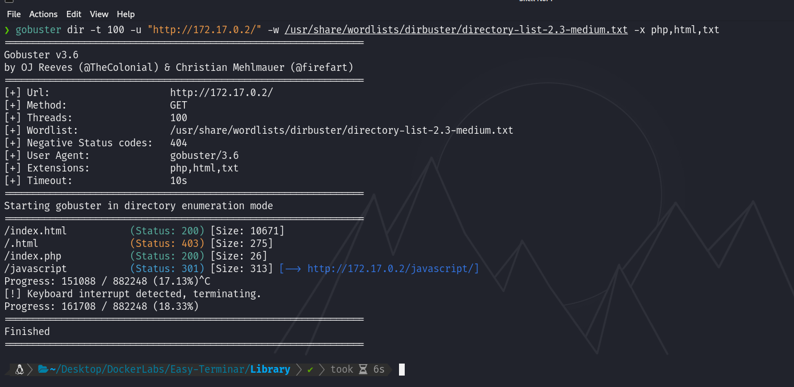

# Maquina Library - DockerLabs.es


Verificar que la maquina este desplegada correctamente


Realizamos un ping a la máquina para verificar la comunicación y confirmamos que la conexión es exitosa.


A continuación, realizamos un escaneo de la IP utilizando Nmap.


Observamos que el puerto 80 y 22 estan abiertos. Ahora realizamos un escaneo adicional para detectar, enumerar servicios y versiones.


En este caso, nos centraremos en el puerto 80 que ejecuta un Apache. Accederemos a la página web alojada en esta máquina utilizando un navegador y veremos lo siguiente.


Al realizar un análisis de Fuzzing, encontramos varios archivos, entre ellos el `index.php`. Al acceder a este archivo, se presenta el siguiente mensaje: `JIFGHDS87GYDFIGD`.




Si recordamos el escaneo que hicimos teniamos el puerto 22 abierto, podemos intentar hacer un ataque por fuerza bruta con Hydra utilizando este mensaje como posible nombre de usuario o contraseña... En este caso para adelantar les diré que es la contraseña y tendremos que atacar el usuario utilizando el diccionario.


Hemos obtenido el usuario asociado a la contraseña. Ahora procederemos a acceder por SSH utilizando las credenciales encontradas.


Y listo, estamos dentro.

## Escalada de Privilegios

Al ejecutar `sudo -l`, observamos que se nos permite ejecutar un script en Python ubicado en la ruta `/opt/script.py` utilizando el binario `/usr/bin/python3`, y esto se puede hacer con cualquier usuario sin necesidad de proporcionar una contraseña.


Si accedemos a ese script y revisamos los permisos, notaremos que nosotros somos los propietarios del mismo.


Con esto en mente, se me ocurre otorgar permisos de escritura al script y modificar su código para que devuelva una `/bin/bash`. Procederemos de la siguiente manera:

```
chmod +w script.py
echo -e 'import os \nos.system("/bin/bash")' > script.py
```


Al ejecutar el script con los permisos que tenemos, obtendremos una shell en modo root.

`sudo /usr/bin/python3 /opt/script.py`


