# Maquina Paradise - DockerLabs.es

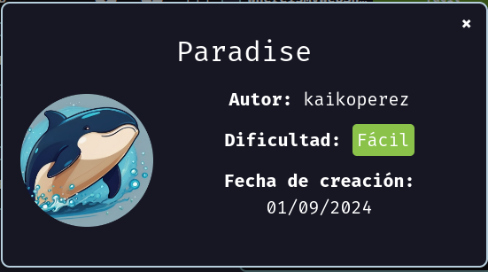

Verificar que la maquina este desplegada correctamente

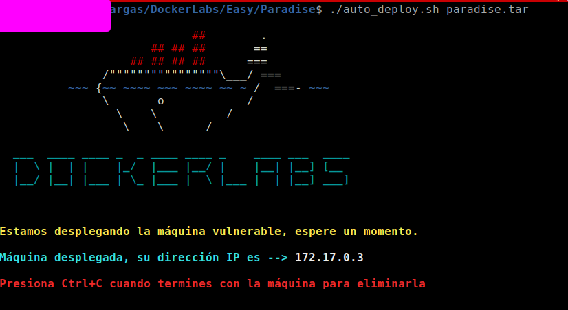

Realizamos un ping a la máquina para verificar la comunicación y confirmamos que la conexión es exitosa.

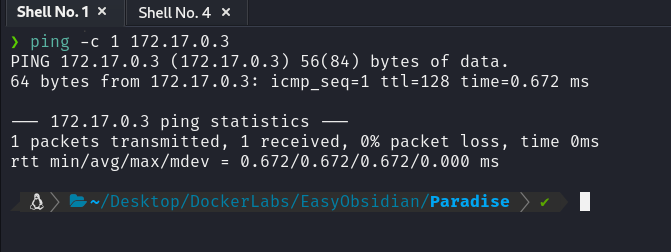

A continuación, realizamos un escaneo de la IP utilizando Nmap.

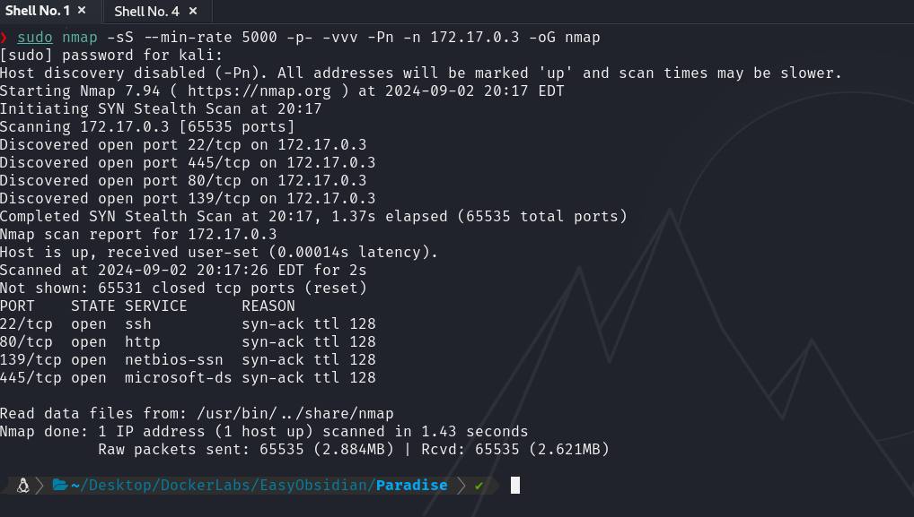

Observamos que el puerto 22,80,139 y 445 estan abiertos. Ahora realizamos un escaneo adicional para detectar, enumerar servicios y versiones.

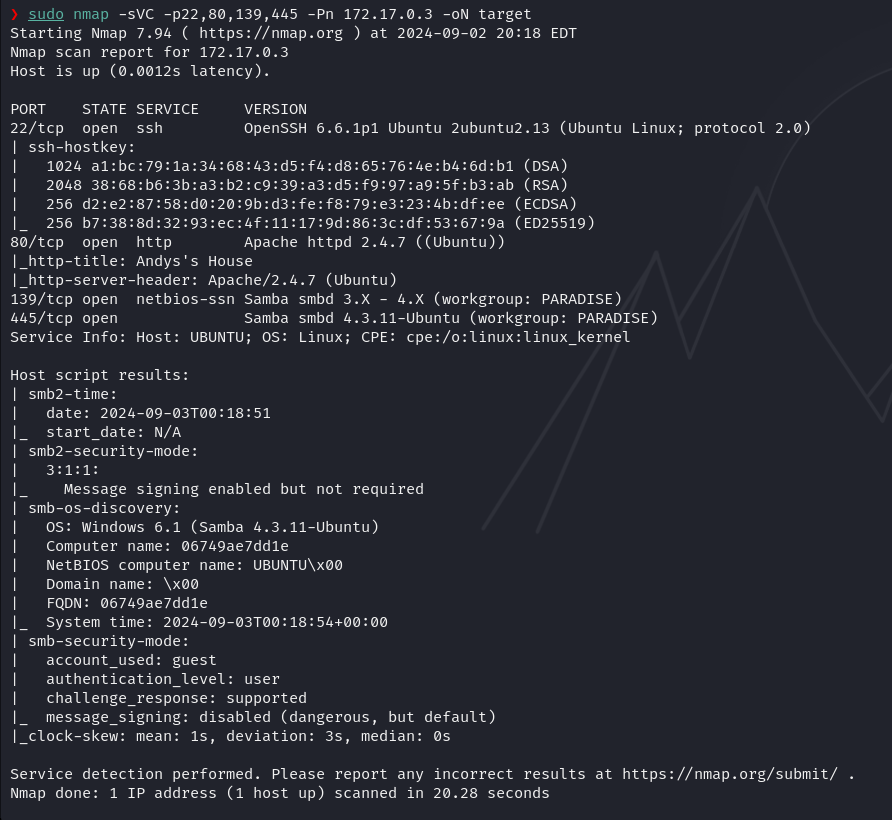

En este caso, nos centraremos en el puerto 80, que ejecuta un servicio HTTP mediante Apache httpd 2.4.7. Accederemos a la página web alojada en esta máquina utilizando un navegador.

Y vemos lo siguiente...

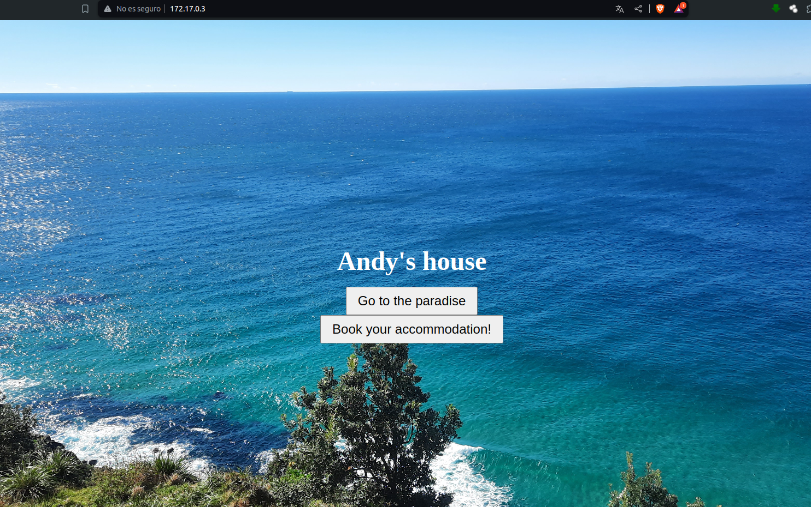

Al hacer clic en el botón que dice "Go to the Paradise", serás dirigido a una sección de la web que contiene una galería de imágenes.

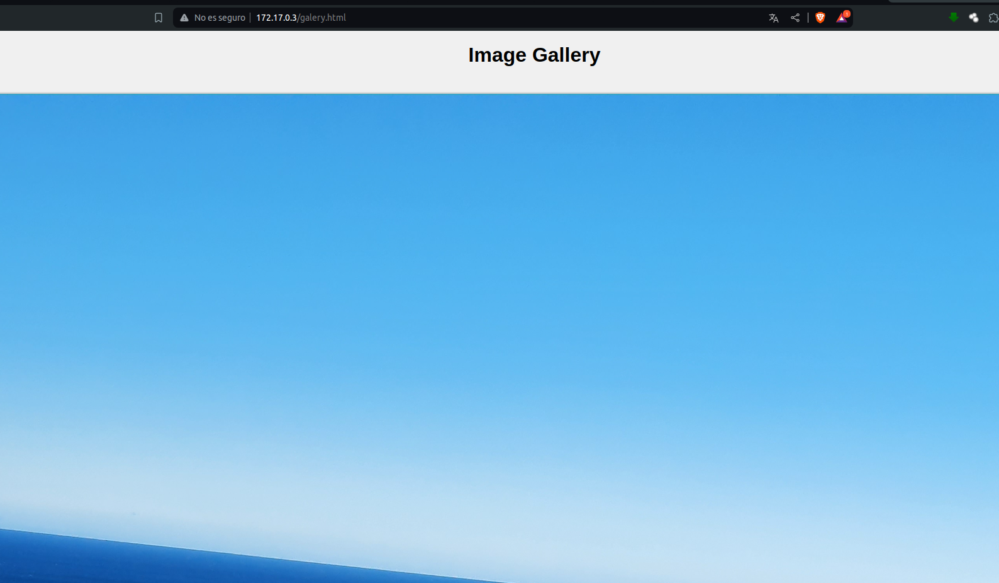

Y si revisamos el código fuente de esa página, notaremos que contiene una codificación en Base64.

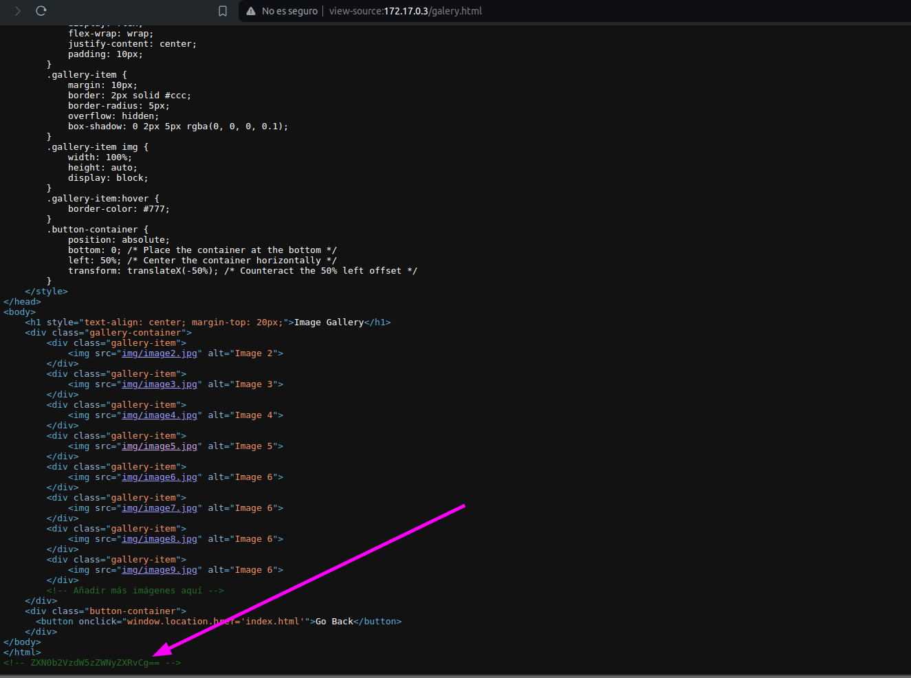

El cual, al ser decodificado, revela lo siguiente:

Ahora bien, hay más opciones que explorar en la página; incluso podríamos realizar un fuzzing para descubrir otros elementos, como "login.php", entre otros. Sin embargo, te advierto que esas vías no parecen ser las más prometedoras.

Como vimos anteriormente, la cadena en Base64 decodifica a `estoesunsecreto`. Si ingresamos esto en la página web, encontraremos un archivo de texto llamado `mensaje_para_lucas.txt`. Este archivo contiene un mensaje dirigido a alguien llamado `lucas`, lo cual nos proporciona un posible usuario con el que podríamos intentar interactuar o explorar más a fondo.

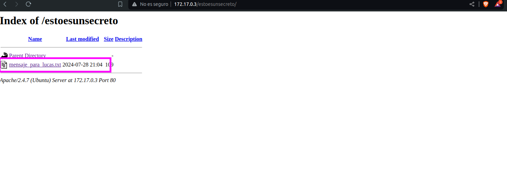

Ahora bien si nos descargamos ese recurso con `wget` y los examinamos veremos lo siguiente

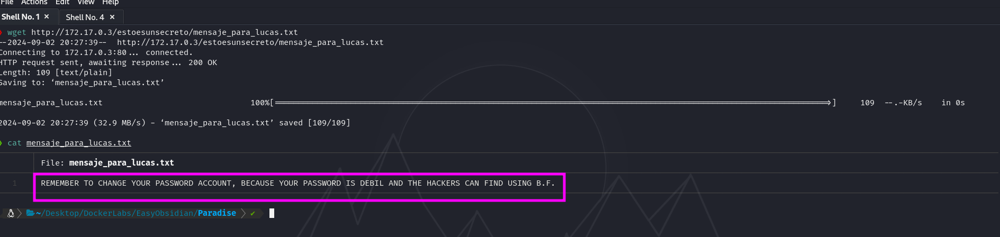

El mensaje en resumen es un recordatorio que le dejaron a `lucas`, y le estan diciendo que recuerde cambiar la contraseña ya que puede ser vulnerable a fuerza bruta...

Ya con esto podemos tener una idea por donde entrar...

Intentaremos hacer un ataque de fuerza bruta con Hydra utilizando como usuario a `lucas` a ver si logramos tener algo de exito....

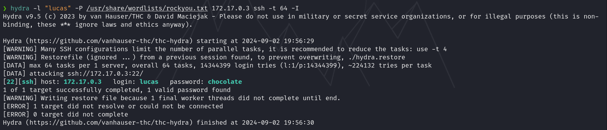

Hemos encontrado una contraseña para el usuario en cuestión. Ahora procederemos a conectarnos a través de SSH utilizando estas credenciales.

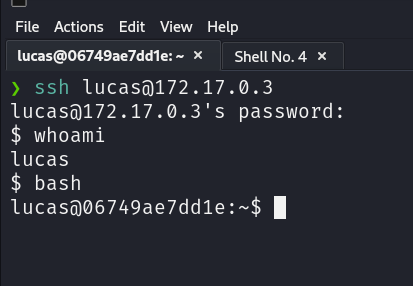

Vemos que ya estamos dentro..

## Escalada de Privilegios

Si realizamos una búsqueda de binarios con permisos SUID y SGID, encontraremos algunos que son especialmente interesantes y en los que tenemos permisos de ejecución.

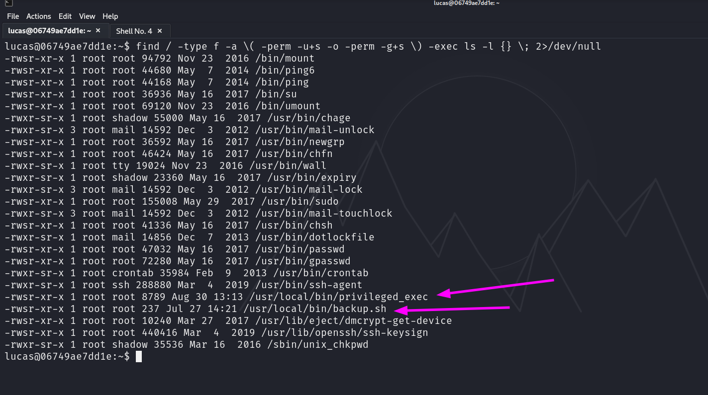

Si ejecutamos el binario /usr/local/bin/privileged_exec por curiosidad, descubriremos que obtenemos privilegios de root.

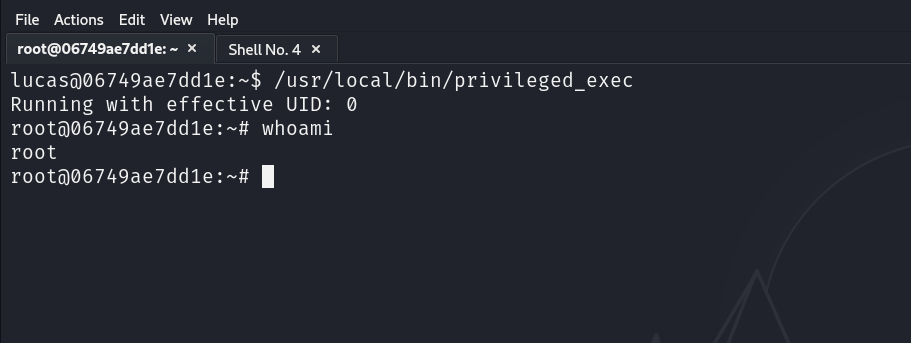
