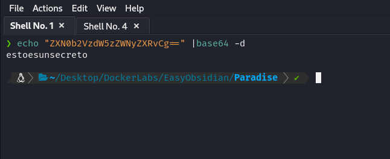

# Maquina Amor - DockerLabs.es

Verificar que la maquina este desplegada correctamente

Realizamos un ping a la máquina para verificar la comunicación y confirmamos que la conexión es exitosa.

A continuación, realizamos un escaneo de la IP utilizando Nmap.

Observamos que el puerto 22,80,139 y 445 estan abiertos. Ahora realizamos un escaneo adicional para detectar, enumerar servicios y versiones.

En este caso, nos centraremos en el puerto 80, que ejecuta un servicio HTTP mediante Apache httpd 2.4.7. Accederemos a la página web alojada en esta máquina utilizando un navegador.

Y vemos lo siguiente...

Si damos click al boton que dice "Go to the Paradise" nos llevara a una parte de la web que tiene una galeria de imagenes.

Y si vemos el código fuente de dicha página notaremos que hay un Base64

El cual si lo decodificamos veremos lo siguiente

Ahora bien, hay mas opciones en la página que visitar, incluso podemos hacer fuzzing y encontrar algunas otras cosas como "login.php" entre otros... Pero ya te digo que por ahi no van los tiros.

Ahora como vimos anteriormente el base64 dice lo siguiente `estoesunsecreto`, si visitamos esto dentro de la pagina web veremos lo siguiente.

Al parecer vemos un fichero de text el cual dice `mensaje_para_lucas.txt`, que basicamente es un mensaje dirigido para alguien llamado `lucas`, lo cual ya me da un usuario potencial con el cual podemos intentar hacer cosillas...

Ahora bien si nos descargamos ese recurso con `wget` y los examinamos veremos lo siguiente

El mensaje en resumen es un recordatorio que le dejaron a `lucas`, y le estan diciendo que recuerde cambiar la contraseña ya que puede ser vulnerable a fuerza bruta...

Ya con esto podemos tener una idea por donde entrar...

Intentaremos hacer un ataque de fuerza bruta con Hydra utilizando como usuario a `lucas` a ver si logramos tener algo de exito....

Vemos que pudimos encontrar una contraseña para dicho usuario, ahora nos conectaremos por SSH utilizando estas credenciales..

Vemos que ya estamos dentro..

## Escalada de Privilegios

Si hacemos una busqueda de binarios SUID SGID notaremos que hay algunos que son muy curiosos en los cuales tenemos permisos de ejecucion...

Si ejecutamos el binario `/usr/local/bin/privileged_exec` por curiosidad veremos que seremos root.

