# Maquina PequeñasMentirosas - DockerLabs.es

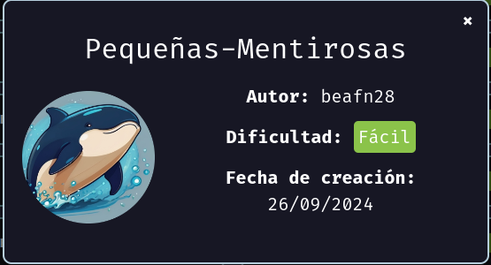

Verificar que la maquina este desplegada correctamente

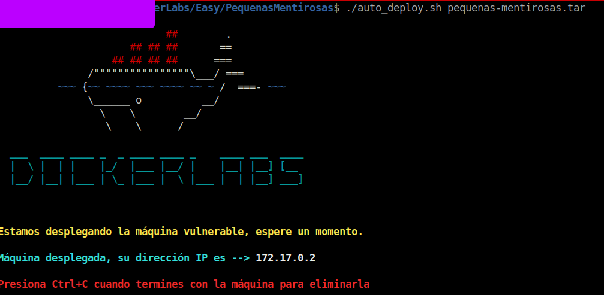

Realizamos un ping a la máquina para verificar la comunicación y confirmamos que la conexión es exitosa.

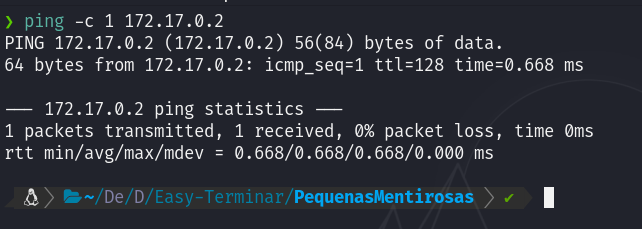

A continuación, realizamos un escaneo de la IP utilizando Nmap.

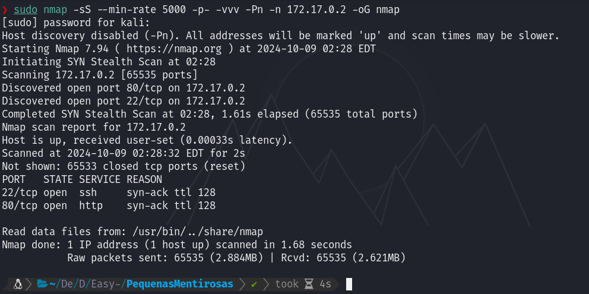

Observamos que el puerto 80 y 22 estan abiertos. Ahora realizamos un escaneo adicional para detectar, enumerar servicios y versiones.

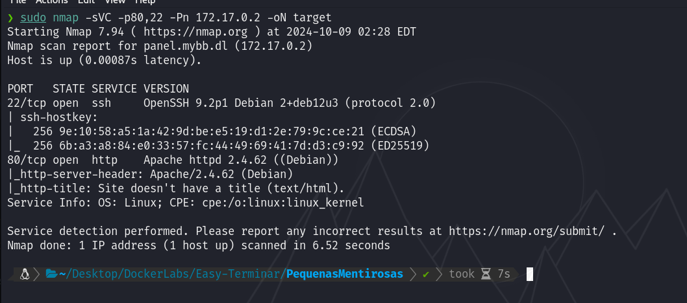

En este caso, nos centraremos en el puerto 80 que ejecuta un Apache. Accederemos a la página web alojada en esta máquina utilizando un navegador y veremos lo siguiente.

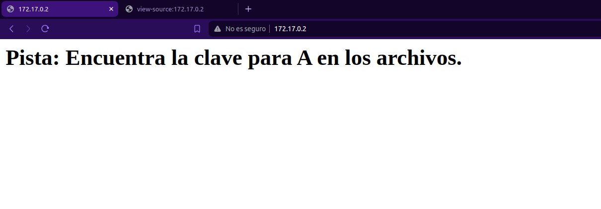

Como vemos solamente es una pagina que tiene un mensaje que dice "Pista: Encuentra la clave para A en los archivos."

Recordemos que esta maquina tiene el puerto 22 abierto que corre un SSH, y segun el mensaje que vemos en la pagina web hay posiblemente un usuario llamado "A" al cual tenemos que encontrar su clave. Usaremos Hydra para hacer ataque por fuera bruta por SSH a ver si obtenemos alguna sesión válida...

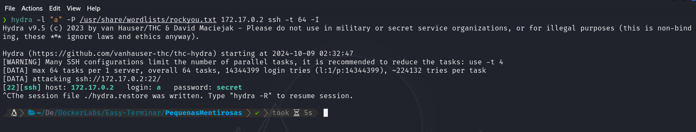

Vemos que logramos encontrar la contraseña para el usuario "a" la cual es `secret`, ahora accederemos por SSH...

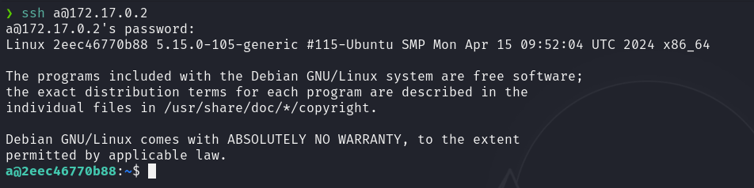

Y ya estamos dentro.

## Escalada de Privilegios

Si vemos los usuarios que existen, notaremos que hay uno llamado `spencer`

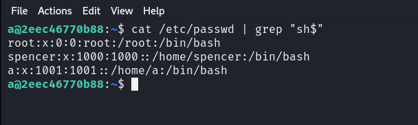

Si hacemos una busqueda de archivos `.txt` de la siguiente manera `find / -name *.txt 2>/dev/null`, veremos que hay algunos muy interesantes...

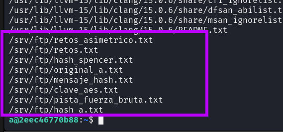

Si vemos el contenido de cada uno de estos archivos con `ls | xargs cat` veremos los siguiente:

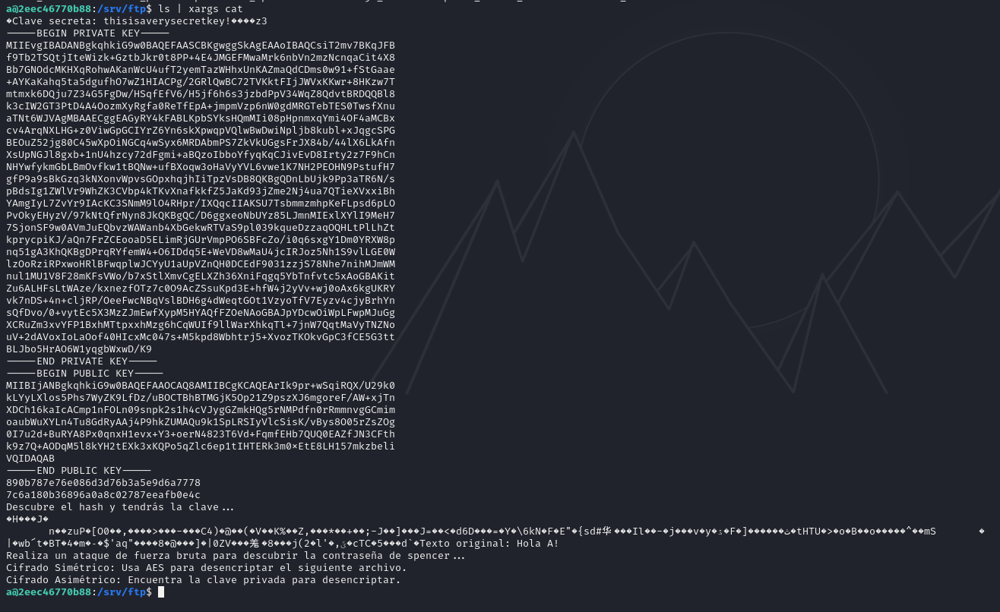

Si vemos específicamente el contenido del archivo que dice `hash_spencer.txt` nos encontraremos con un hash en `MD5`

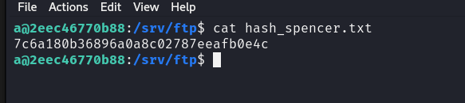

Si tratamos de romper ese hash con alguna herramienta como `CrackStation` veremos que obtendremos lo siguiente...

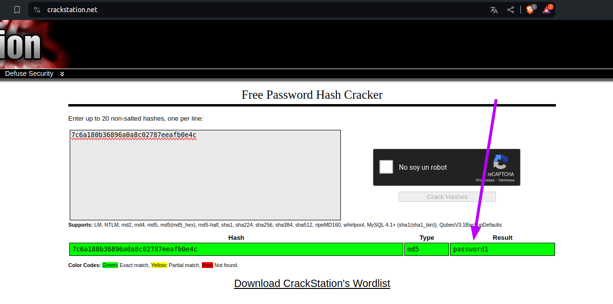

Si cambiamos al usuario `spencer` y proporcionamos la contraseña `password1`

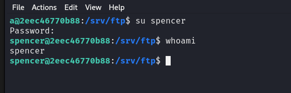

Ahora bien, si ejecutamos un `sudo -l` con este usuario veremos que podemos ejecutar el binario de `/usr/bin/python3` como cualquier usuario sin propocionar contraseña.

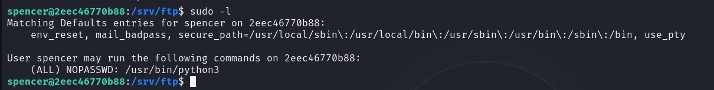

Nos aprovecharemos de estos permisos de la siguiente manera para escalar privilegios.

`sudo /usr/bin/python3 -c "import os; os.system('/bin/bash')"`

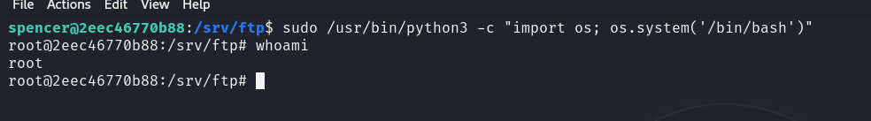

Y ya seriamos root!
