# Maquina Pntopntobarra - DockerLabs.es

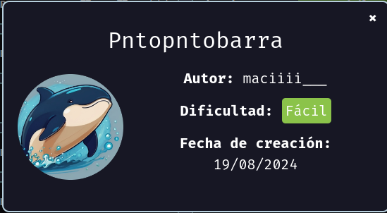

Verificar que la maquina este desplegada correctamente

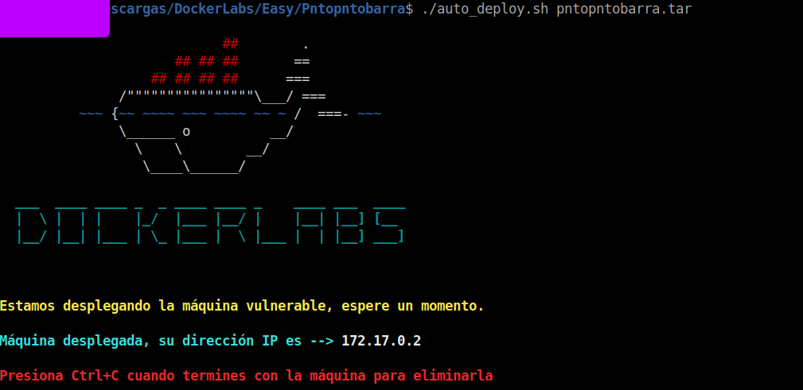

Realizamos un ping a la máquina para verificar la comunicación y confirmamos que la conexión es exitosa.

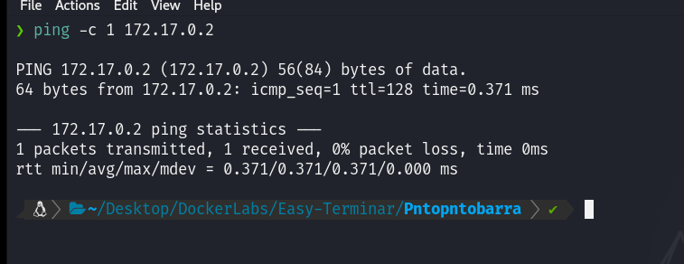

A continuación, realizamos un escaneo de la IP utilizando Nmap.

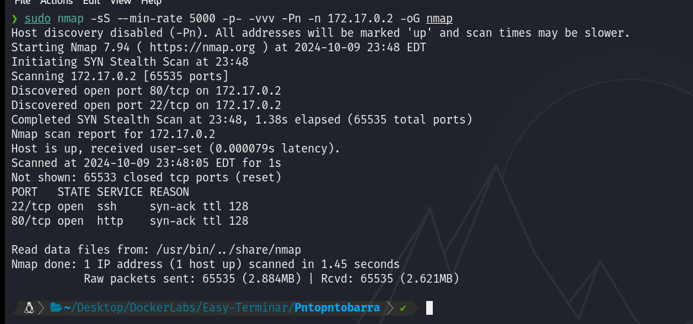

Observamos que el puerto 80 y 22 estan abiertos. Ahora realizamos un escaneo adicional para detectar, enumerar servicios y versiones.

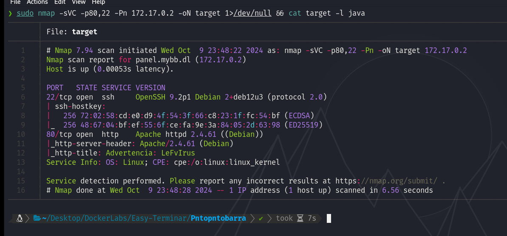

En este caso, nos centraremos en el puerto 80 que ejecuta un Apache. Accederemos a la página web alojada en esta máquina utilizando un navegador y veremos lo siguiente.

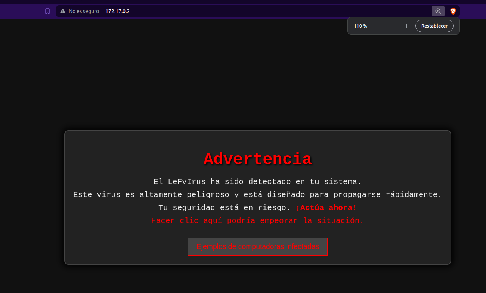

Y tambien veremos lo siguiente al entrar en `Ejemplos de computadoras infectadas`

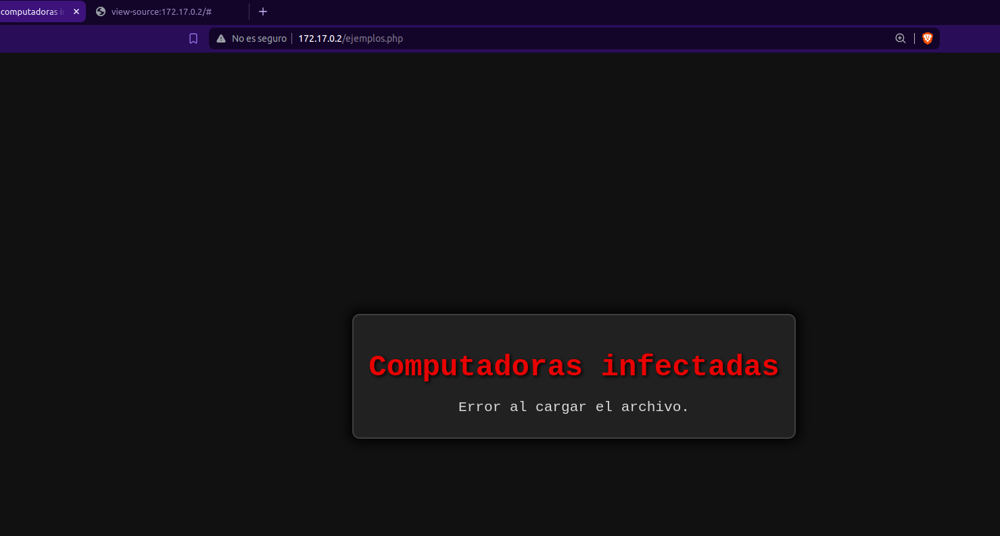

Si aplicamos Fuzzing a la web encontraremos algunas cosas interesantes como `t.php`

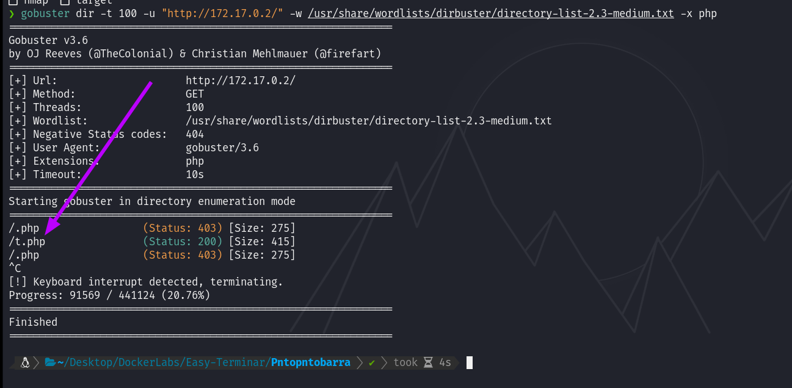

Después de experimentar con diversas técnicas, decidí aplicar Fuzzing utilizando Wfuzz en `t.php` con el objetivo de identificar algún parámetro susceptible de ser explotado para llevar a cabo un LFI. Durante esta prueba, descubrí un parámetro llamado `images`.

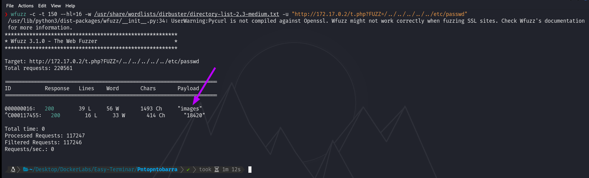

Al ejecutar el comando `curl "http://172.17.0.2/t.php?images=/etc/passwd"`, podemos observar que se muestra el contenido de `/etc/passwd`.

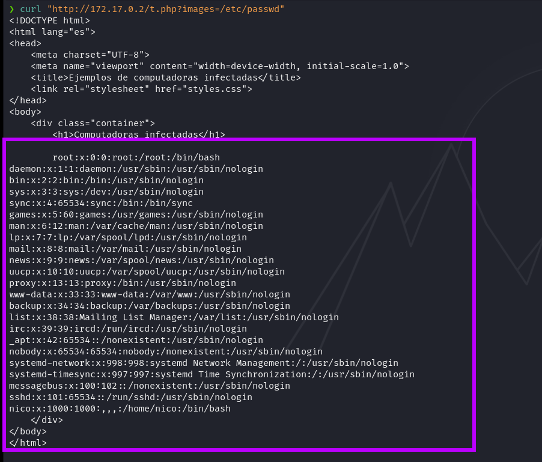

Vemos que en la lista de usuarios hay uno llamado `nico`, recordemos que el puerto 22 esta abierto, entonces haremos un ataque por fuerza bruta con Hydra a SSH a ver si logramos encontrar la contraseña para dicho usuario...

Vemos que encontramos la contraseña para el usuario.

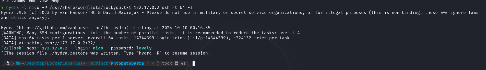

Ahora procederemos a iniciar sesión por SSH utilizando el usuario `nico` y la contraseña `lovely`.

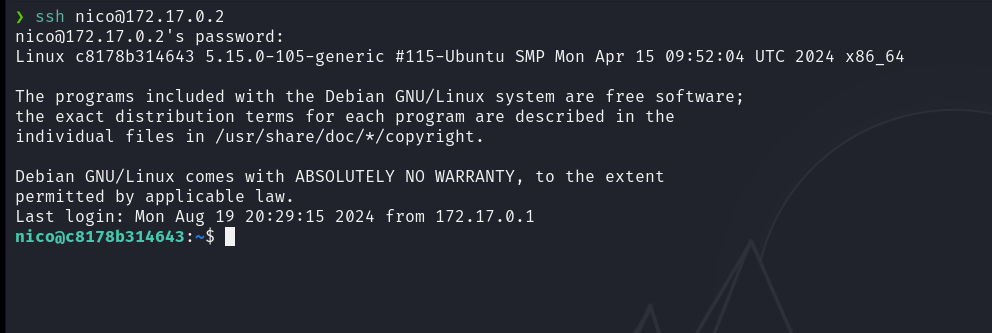

Y ya estamos dentro.

## Escalada de Privilegios

Al ejecutar `sudo -l`, observamos que podemos ejecutar el binario `/bin/env` como cualquier usuario sin necesidad de proporcionar una contraseña.

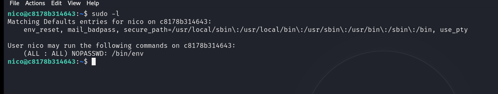

Aprovecharemos estos permisos para escalar privilegios de la siguiente manera:

`sudo /bin/env /bin/bash`

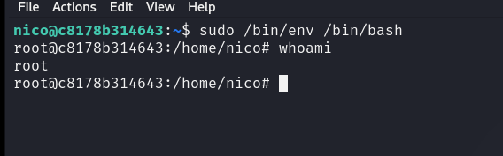

Y obtendremos una shell en modo root.
