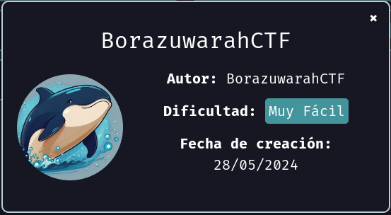

# Maquina BorazuwarahCTF - DockerLabs.es

Verificar que la maquina este desplegada correctamente

<!-- ![[Pasted image 20240818191719.png]] -->

Realizamos un ping a la máquina para verificar la comunicación y confirmamos que la conexión es exitosa.

<!-- ![[Pasted image 20240818191913.png]] -->

A continuación, realizamos un escaneo de la IP utilizando Nmap.

<!-- ![[Pasted image 20240818193049.png]] -->

Observamos que el puerto 22 y 80 está abierto. Ahora realizamos un escaneo adicional para detectar, enumerar servicios y versiones.

<!-- ![[Pasted image 20240818193217.png]] -->

En este caso, nos centraremos en el puerto 80, que ejecuta un servicio HTTP mediante **Apache httpd 2.4.59**. Accederemos a la página web alojada en esta máquina utilizando un navegador.

<!-- ![[Pasted image 20240818193636.png]] -->

Actualmente, solo podemos observar una página web con una imagen de un "Huevo Kinder". En situaciones como esta, podemos realizar varias acciones, como:

- **Aplicar Fuzzing** en la página web para identificar posibles recursos adicionales que puedan ofrecer nuevas vías de ataque.
- **Examinar el código fuente de la página** para buscar información que pueda ser útil.
- **Analizar los metadatos de las imágenes** y otros archivos para intentar obtener datos que puedan revelar detalles como nombres de usuario u otra información relevante.

Para avanzar, descargaremos la imagen del "Huevo Kinder" y extraeremos sus metadatos para determinar si contiene información interesante.

Primero descargaremos la imagen utilizando `wget urlDeLaImagen`

<!-- ![[Pasted image 20240818200350.png]] -->

A continuación, utilizaremos una herramienta para extraer los metadatos de la imagen. En mi caso, emplearé `exiftool` para realizar esta tarea.

<!-- ![[Pasted image 20240818200653.png]] -->

Hemos identificado un posible usuario con el cual podríamos intentar realizar una acción. Para avanzar de manera directa, procederemos con un ataque de fuerza bruta utilizando Hydra, dirigido al puerto 22, que está ejecutando un servicio SSH, empleando el usuario `borazuwarah` que hemos encontrado.

<!-- ![[Pasted image 20240818201215.png]] -->

Hemos encontrado una contraseña válida para el usuario, que es `123456`. Con esta información, procederemos a iniciar sesión en el servicio SSH utilizando las credenciales obtenidas.

<!-- ![[Pasted image 20240818201705.png]] -->

Y ya estamos dentro!

## Escalada de Privilegios

**_Desde ahorita te adelanto que hay varias maneras de escalar privilegios en esta maquina!_**

Al ejecutar el comando `sudo -l`, podremos ver los permisos configurados, que se mostrarán de la siguiente manera:

<!-- ![[Pasted image 20240818202813.png]] -->

Al observar los permisos, notamos que es posible realizar escalado de privilegios de varias maneras, ya que nos permite ejecutar prácticamente cualquier comando en modo "root" siempre que proporcionemos la contraseña. Por ejemplo:

Realizaré una prueba utilizando el comando `sudo more` para leer el archivo `/etc/passwd`. A continuación, se nos pedirá la contraseña, que es `123456`, como hemos identificado previamente.

<!-- ![[Pasted image 20240818203823.png]] -->

<!-- ![[Pasted image 20240818203917.png]] -->

También tenemos permiso para ejecutar el binario `/bin/bash` en modo "root" sin necesidad de proporcionar una contraseña. Lo haremos con el siguiente comando: `sudo /bin/bash -p`. De este modo, obtendremos acceso como root.

<!-- ![[Pasted image 20240818204156.png]] -->

Otra forma más sencilla de hacerlo es la siguiente. Primero, verificaremos a qué grupos pertenece el usuario con el que estamos logueados utilizando el comando `id`. Como podemos observar, el usuario pertenece al grupo `sudo`.

<!-- ![[Pasted image 20240818204537.png]] -->

Entonces, podemos escalar a modo "root" fácilmente ejecutando el comando `sudo su` con el usuario actual.

<!-- ![[Pasted image 20240818204638.png]] -->

