# Maquina BreakMySSH - DockerLabs.es

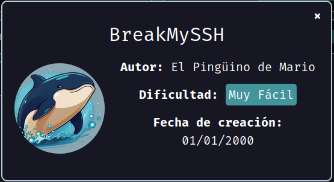

Primero, debemos verificar que nuestra máquina esté correctamente desplegada.

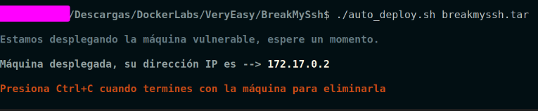

Realizamos un ping a la máquina para verificar la comunicación y confirmamos que la conexión es exitosa.

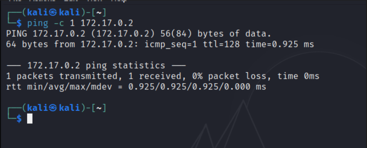

A continuación, realizamos un escaneo de la IP utilizando Nmap.

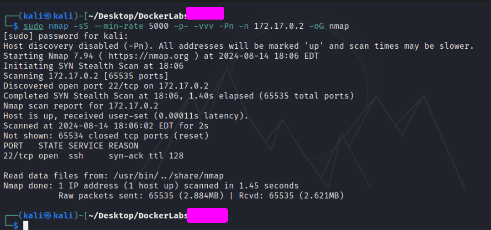

Observamos que el puerto 22 está abierto. Ahora realizamos un escaneo adicional para detectar, enumerar servicios y versiones.

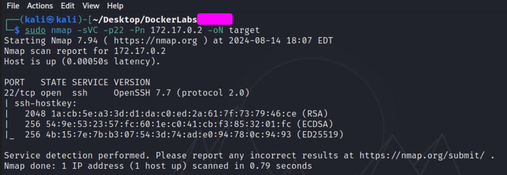

El puerto 22 está ejecutando el servicio SSH en su versión `OpenSSH 7.7`, la cual presenta una vulnerabilidad conocida asociada al `CVE CVE-2018–15473`. Esta vulnerabilidad permite a usuarios remotos determinar nombres de usuario válidos en el sistema objetivo mediante la enumeración de usuarios.

Con esta información, podemos crear o buscar exploits en plataformas como ExploitDB o en otros recursos en línea para explotar esta vulnerabilidad.

En mi caso, he optado por utilizar un exploit disponible en el siguiente repositorio: https://github.com/Sait-Nuri/CVE-2018-15473.

Para utilizar este exploit, primero es necesario otorgarle permisos de ejecución con el comando `chmod +x nombreExploit.py`. Luego, ejecutamos el exploit pasando la IP de la máquina vulnerable junto con la opción `-w` para indicar un diccionario de nombres de usuario (en mi caso, utilicé el diccionario `rockyou`).

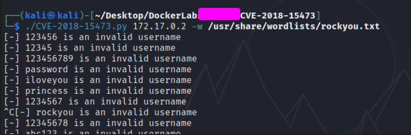

Al ejecutar el exploit, observamos que devuelve tanto nombres de usuarios válidos como no válidos. Para filtrar únicamente los usuarios válidos, podemos utilizar el comando `grep -v "invalid"`, lo que nos permitirá obtener solo los nombres de usuario correctos.

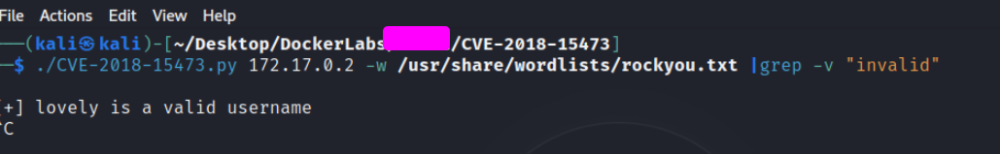

Hemos encontrado un usuario válido llamado "lovely". A partir de esto, podríamos intentar realizar un ataque de fuerza bruta utilizando Hydra contra el puerto 22 por SSH, empleando el nombre de usuario que hemos descubierto.

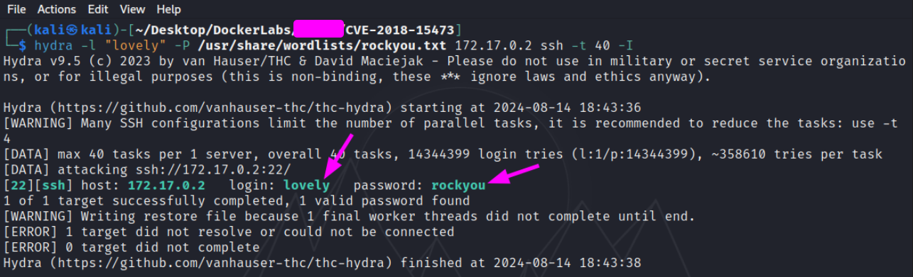

Hemos logrado encontrar la contraseña del usuario "lovely", la cual es "rockyou". Ahora, solo queda conectarnos a la máquina víctima mediante SSH utilizando estas credenciales.

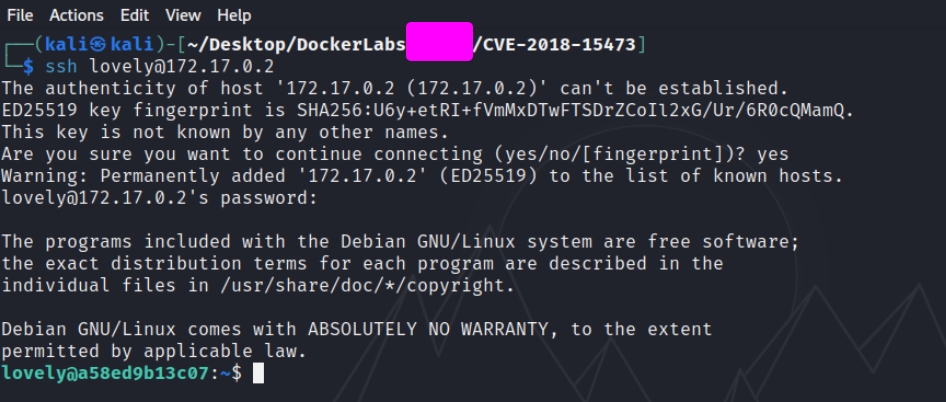

## Escalada de Privilegios

Estuve explorando diferentes métodos, y uno de ellos fue realizar un ataque de fuerza bruta utilizando Hydra contra el usuario root. El comando que utilicé fue el siguiente:

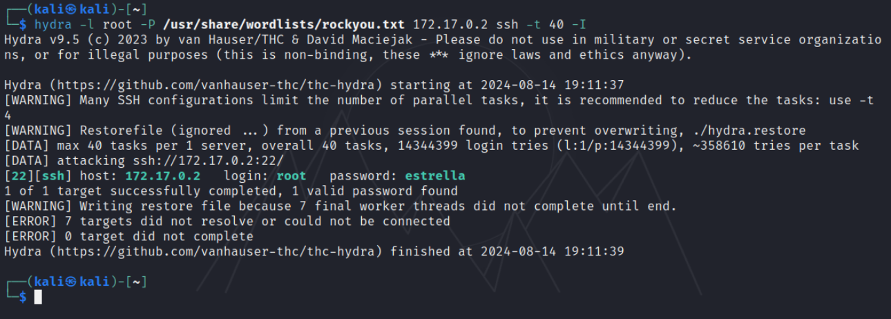

Elegí este usuario por intuición, pero también se puede intentar encontrar otros usuarios realizando una enumeración con un diccionario, utilizando el exploit mencionado anteriormente.

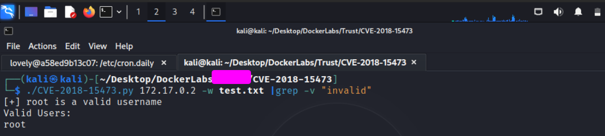

Ahora solo queda iniciar sesión como "root" a través de SSH.

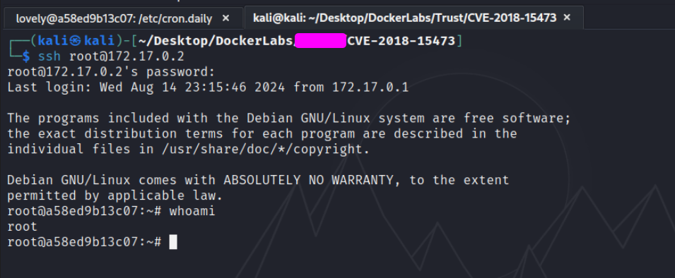

Y como vemos ya logramos obtener una shell en modo root!
