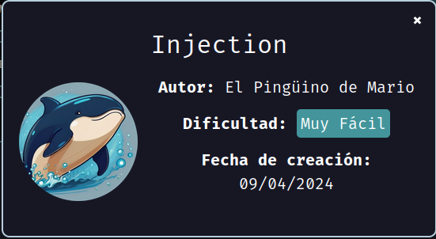

# Maquina Injection - DockerLabs.es



Primero, debemos verificar que nuestra máquina esté correctamente desplegada.


Realizamos un ping a la máquina para verificar la comunicación y confirmamos que la conexión es exitosa.


A continuación, realizamos un escaneo de la IP utilizando Nmap.


Observamos que el puerto 80 y el 22 está abierto. Ahora realizamos un escaneo adicional para detectar, enumerar servicios y versiones.


Observamos que el puerto 80 está ejecutando un servicio bajo el protocolo HTTP, específicamente un servidor Apache HTTPD en su versión 2.4.52. Vamos a intentar acceder a través del navegador para ver qué nos muestra.

Como podemos ver, nos encontramos con una página de inicio de sesión.


Podemos comenzar intentando ingresar con credenciales comunes que algunas aplicaciones suelen tener por defecto, como admin, administrator, root, user, password, entre otras. Siempre vale la pena intentarlo, por si acaso...

Sin embargo, para adelantarnos, parece que este enfoque no será efectivo. La solución para superar este login podría involucrar la inserción de una inyección SQL.

Supongamos que la consulta SQL que respalda este login es la siguiente:


Podríamos inyectar el siguiente Payload:

```
' OR 1=1-- -
```

De tal forma que por detras la consulta podria quedar de la siguiente manera:


Esto nos permitirá evitar el login sin necesidad de proporcionar un usuario o contraseña válidos, ya que la segunda condición (OR 1=1) siempre se cumple, devolviendo un resultado "verdadero".


¡Como podemos ver, logramos iniciar sesión correctamente!

Además, observamos un mensaje de bienvenida dirigido a alguien llamado "Dylan", quien podría ser un usuario potencial para futuras acciones. También se nos ha mostrado una "contraseña".

Ahora recordemos que cuando hicimos el escaneo pudimos ver que tambien estaba abierto el puerto 22 el cual por detras está corriendo el servicio de SSH.


Podríamos intentar acceder a esta máquina mediante SSH, utilizando el usuario "Dylan" y la contraseña que obtuvimos después de iniciar sesión en la página web.


Vemos que logramos ingresar con éxito.

Ahora, el siguiente paso es buscar la manera de escalar privilegios. Ejecutamos sudo -l para revisar los permisos del usuario.


Vemos que no obtenemos resultados; al parecer, el comando sudo no está disponible.

Intentaremos buscar binarios con permisos SUID o SGID en el sistema para ver si encontramos alguno que podamos explotar y así escalar privilegios.

Aquí dejo los comandos para encontrar tanto SUID como SGID a la vez:

```
find / -type f -a \( -perm -u+s -o -perm -g+s \) -exec ls -l {} \; 2>/dev/null
```

Observamos que hay un binario en `/usr/bin/env`. Al consultar GTFOBins, podemos ver que este binario puede ser explotado si tiene permisos SUID.


Para explotarlo, procederemos de la siguiente manera:


¡Como podemos ver, ya logramos obtener una shell con privilegios de root!
