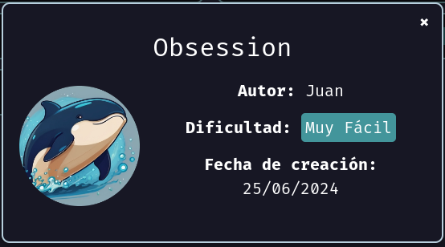
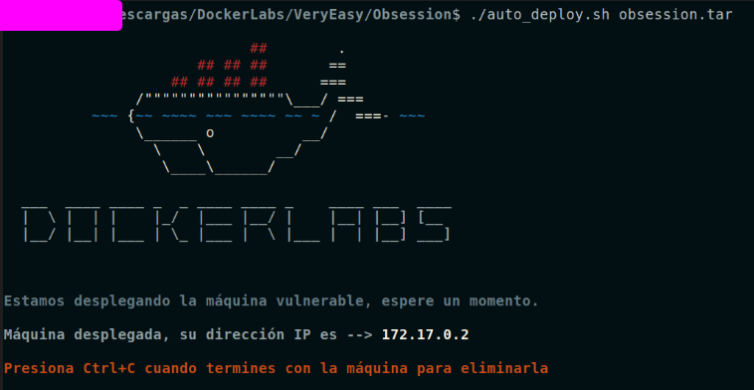

# Maquina Obsession - DockerLabs.es

Verificar que la maquina este desplegada correctamente

<!-- ![[Pasted image 20240819191115.png]] -->

Realizamos un ping a la máquina para verificar la comunicación y confirmamos que la conexión es exitosa.

<!-- ![[Pasted image 20240819160115.png]] -->

A continuación, realizamos un escaneo de la IP utilizando Nmap.

<!-- ![[Pasted image 20240819160347.png]] -->

Observamos que el puerto 21, 22 y 80 está abierto. Ahora realizamos un escaneo adicional para detectar, enumerar servicios y versiones.

<!-- ![[Pasted image 20240819160435.png]] -->

Como se puede observar, hay muchas cosas interesantes que explorar aquí. Sin embargo, comenzaremos por centrarnos en el puerto 80, donde está funcionando un servidor Apache. Accederemos a la URL de la máquina a través del navegador para examinar el sitio web que tiene alojado.

A continuación, observamos lo siguiente:

<!-- ![[Pasted image 20240819161236.png]] -->

Si inspeccionamos el código fuente de la página con atención, podremos encontrar un comentario que ofrece una pequeña pista o "recordatorio". Este comentario dice: `Utilizando el mismo usuario para todos mis servicios, podré recordarlo fácilmente`.

<!-- ![[Pasted image 20240819161356.png]] -->

Podríamos intentar aplicar **Fuzzing** en la web para descubrir posibles rutas que amplíen nuestras oportunidades de ataque. Sin embargo, en este caso, esa no parece ser la dirección correcta.

Ahora nos centraremos en el puerto 21, donde está corriendo un servicio FTP con la versión `vsftpd 3.0.5`. Observamos que se permite el acceso anónimo (`ftp-anon: Anonymous FTP login allowed (FTP code 230)`), lo que indica que el código de estado 230 en FTP significa que el inicio de sesión anónimo ha sido exitoso. Esto permite que cualquier persona se conecte al servidor sin necesidad de autenticarse con un nombre de usuario o contraseña.

Además, notamos que hay algunos archivos disponibles para descarga. Podemos examinarlos para ver si contienen información interesante que pueda ser útil.

<!-- ![[Pasted image 20240819162610.png]] -->

Ahora procederemos a descargar los archivos `chat-gonza.txt` y `pendientes.txt` utilizando FTP, con el usuario `anonymous`, de la siguiente manera:

<!-- ![[Pasted image 20240819163501.png]] -->

Una vez dentro, al ejecutar el comando `ls -la` o `ls -l`, podremos ver los archivos que estamos buscando.

<!-- ![[Pasted image 20240819163630.png]] -->

Ahora descargaremos los archivos a nuestro directorio de trabajo actual utilizando el comando `mget nombreDelArchivo`.

<!-- ![[Pasted image 20240819163714.png]] -->

Si aplicamos el comando `cat` al archivo llamado `chat-gonza.txt`, veremos lo siguiente:

<!-- ![[Pasted image 20240819164125.png]] -->

Parece que el archivo `chat-gonza.txt` contiene una conversación por chat entre dos personas o usuarios, uno llamado "Gonza" y el otro "Russoski". Este último nombre coincide con los utilizados en la página web, tanto en la dirección de correo electrónico como en el aviso de copyright. Además, recordemos que en el código fuente de la página había un comentario que decía: **"Utilizando el mismo usuario para todos mis servicios, podré recordarlo fácilmente"**. Esto sugiere que "Russoski" podría ser un usuario potencial que se utiliza en múltiples servicios, lo que nos da indicios de que podríamos realizar ciertas acciones utilizando este usuario.

<!-- ![[Pasted image 20240819164407.png]] -->

Tomando a `russoski` como usuario potencial, realizaremos un ataque por fuerza bruta utilizando Hydra a través del puerto 22, que está ejecutando un servicio SSH.

<!-- ![[Pasted image 20240819165017.png]] -->

Hemos conseguido obtener la contraseña de dicho usuario. Ahora iniciaremos sesión con estas credenciales a través de SSH.

<!-- ![[Pasted image 20240819165122.png]] -->

Y ya estamos dentro!

## Escalada de Privilegios

Si hacemos un `sudo -l` para ver los permisos que tenemos veremos lo siguiente:

<!-- ![[Pasted image 20240819165334.png]] -->

Hemos observado que podemos ejecutar el binario `vim` en modo root sin necesidad de proporcionar una contraseña, lo que nos permitirá escalar privilegios.

Para realizar la escalada de privilegios, usaremos el siguiente comando: `sudo vim -c '!/bin/bash'`. Esto nos proporcionará una shell con privilegios de root.

<!-- ![[Pasted image 20240819165524.png]] -->

## (Opcional) Curiosidades de la Máquina

Esta máquina esconde varias sorpresas. Si ejecutamos el comando `cat` sobre el archivo `pendientes.txt`, encontraremos algunas pistas que nos ayudarán a escalar privilegios.

<!-- ![[Pasted image 20240819165809.png]] -->

Además, si leemos detenidamente la conversación en el archivo `chat-gonza.txt`, encontraremos detalles interesantes.

<!-- ![[Pasted image 20240819165945.png]] -->

En la conversación, se habla de una chica que parece ser muy atractiva, probablemente un 9 de 10.

Además, descubrimos que "Russoski" tiene guardada una URL de un video que le hizo a la chica en un lugar seguro. Vamos a buscar esa URL y ver el video que realizó.

La URL del vídeo se encuentra dentro del directorio principal de trabajo de "root" y es el siguiente `https://www.youtube.com/shorts/_v8GzGReTAk`

<!-- ![[Pasted image 20240819170534.png]] -->

Y este es el vídeo :)

<!-- ![[Pasted image 20240819170703.png]] -->

