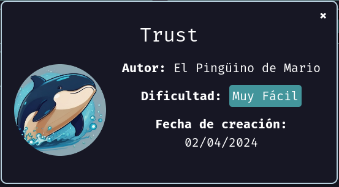

# Maquina Trust - DockerLabs.es

Verificar que la maquina este desplegada correctamente

<!-- ![[Pasted image 20240819011102.png]] -->

Realizamos un ping a la máquina para verificar la comunicación y confirmamos que la conexión es exitosa.

<!-- ![[Pasted image 20240819011447.png]] -->

A continuación, realizamos un escaneo de la IP utilizando Nmap.

<!-- ![[Pasted image 20240819013134.png]] -->

Observamos que el puerto 22 y 80 está abierto. Ahora realizamos un escaneo adicional para detectar, enumerar servicios y versiones.

<!-- ![[Pasted image 20240819014509.png]] -->

En este caso, nos centraremos en el puerto 80, que ejecuta un servicio HTTP mediante **Apache httpd 2.4.57**. Accederemos a la página web alojada en esta máquina utilizando un navegador.

<!-- ![[Pasted image 20240819014748.png]] -->

Como podemos observar, se nos muestra la página predeterminada del servidor Apache. A continuación, procederemos a realizar un **Fuzzing** para explorar posibles páginas adicionales que podrían ampliar las oportunidades de ataque.

En esta instancia, nos enfocaremos en buscar archivos con la extensión `.php` para identificar potenciales vectores de ataque.

<!-- ![[Pasted image 20240819015814.png]] -->

Hemos encontrado un nuevo archivo llamado `secret.php` que no conocíamos previamente. Al acceder a él, veremos lo siguiente:

<!-- ![[Pasted image 20240819020254.png]] -->

Al intentar ver el código fuente de la página, no encontraremos información interesante que pueda ser útil para nuestros propósitos.

<!-- ![[Pasted image 20240819020352.png]] -->

Sin embargo, al examinar detenidamente el mensaje, notamos que dice: _**Hola Mario, Esta web no se puede hackear**_. Este saludo específico, _**Hola Mario**_, parece dirigirse a una persona o usuario en particular, lo que nos sugiere un posible nombre de usuario con el que podríamos intentar realizar acciones adicionales.

Dado que, como vimos anteriormente, el puerto 22 está abierto y ejecuta un servicio SSH, procederemos a realizar un ataque de fuerza bruta en este puerto utilizando Hydra, con el nombre de usuario `mario`, para ver qué resultados obtenemos.

<!-- ![[Pasted image 20240819020904.png]] -->

Hemos logrado encontrar una contraseña válida para el usuario `mario`. Ahora procederemos a iniciar sesión en el servidor mediante SSH utilizando estas credenciales.

<!-- ![[Pasted image 20240819021006.png]] -->

Y ya estamos dentro!

## Escalada de Privilegios

Si ejecutamos el comando `sudo -l` podremos ver lo siguientes permisos

<!-- ![[Pasted image 20240819021119.png]] -->

Observamos que podemos ejecutar el binario `vim` con privilegios de usuario "root". Esto nos permite escalar nuestros privilegios mediante el siguiente procedimiento:

1. Utilizamos el comando `sudo vim /etc/passwd` para abrir el archivo `/etc/passwd`.
2. Una vez dentro de `vim`, presionamos la combinación de teclas para ingresar el modo de comandos (generalmente `Esc`).
3. Luego, ingresamos `:! /bin/bash` y presionamos `Enter`.

Esto nos permitirá ejecutar un shell de `bash` con privilegios de root, otorgándonos acceso completo al sistema.

<!-- ![[Pasted image 20240819021754.png]] -->

<!-- ![[Pasted image 20240819021647.png]] -->

<!-- ![[Pasted image 20240819021729.png]] -->

Una forma más sencilla de lograrlo utilizando `vim` es ejecutar el siguiente comando:
`sudo vim -c ':!/bin/bash'`
Este comando abre `vim` directamente en modo de comandos y ejecuta un shell de `bash` con privilegios de root, simplificando el proceso de escalación de privilegios.

<!-- ![[Pasted image 20240819021901.png]] -->

