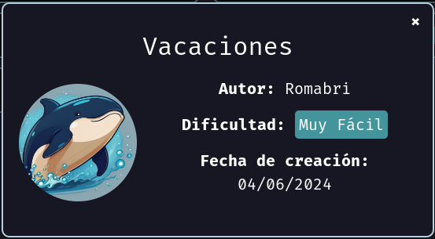

# Maquina Vacaciones - DockerLabs.es

Verificar que la maquina este desplegada correctamente

<!-- ![[Pasted image 20240819200321.png]] -->

Realizamos un ping a la máquina para verificar la comunicación y confirmamos que la conexión es exitosa.

<!-- ![[Pasted image 20240819200652.png]] -->

A continuación, realizamos un escaneo de la IP utilizando Nmap.

<!-- ![[Pasted image 20240819200757.png]] -->

Observamos que el puerto 22 y 80 está abierto. Ahora realizamos un escaneo adicional para detectar, enumerar servicios y versiones.

<!-- ![[Pasted image 20240819200841.png]] -->

Vamos a centrarnos en el puerto 80, donde está funcionando un servidor Apache. Accederemos a la URL de la máquina a través del navegador para examinar el sitio web que tiene alojado.

A continuación, observamos lo siguiente:

<!-- ![[Pasted image 20240819201038.png]] -->

La web parece estar completamente en blanco. Sin embargo, al revisar el código fuente de la página, encontramos un mensaje interesante que dice: _**De: Juan Para: Camilo, te he dejado un correo, es importante...**_

<!-- ![[Pasted image 20240819201155.png]] -->

Parece que el mensaje se refiere a dos personas o usuarios. A primera vista, podríamos suponer que estos nombres podrían ser usuarios potenciales para realizar ciertas acciones.

Para confirmar esta suposición, intentaremos un ataque de fuerza bruta utilizando Hydra a través del puerto 22, que ofrece el servicio SSH. Probaremos con los usuarios `juan` y `camilo` para ver si conseguimos acceso.

<!-- ![[Pasted image 20240819202455.png]] -->

Con paciencia, conseguimos obtener la contraseña del usuario `camilo`.

Dado que el puerto 22 está abierto y ejecuta el servicio SSH, ahora ingresaremos al sistema utilizando estas credenciales.

<!-- ![[Pasted image 20240819202643.png]] -->

Y ya estamos dentro!

## Escalada de Privilegios

Primero, podrías intentar escalar privilegios utilizando las diferentes técnicas que conoces mientras estás logueado como el usuario `camilo`. Es posible que no consigas escalar privilegios (o quizás si).

Recuerda el comentario que vimos en el código fuente de la web: _**De: Juan Para: Camilo, te he dejado un correo, es importante...**_.

Si eres curioso y exploras bien las carpetas dentro de la máquina, encontrarás un archivo llamado `correo.txt` en la siguiente ruta: `/var/mail/camilo`. Este archivo es la pista que el comentario de la página web nos estaba dando desde el principio. Al ejecutar `cat` para ver el contenido de este archivo, encontraremos lo siguiente:

<!-- ![[Pasted image 20240819203315.png]] -->

Como podemos ver, el archivo `correo.txt` contiene una contraseña. Dado que el mensaje es de "Juan" para "Camilo", la contraseña proporcionada sería la de "Juan".

Ahora intentemos iniciar sesión por SSH con el usuario `juan` utilizando la contraseña `2k84dicb`.

<!-- ![[Pasted image 20240819204120.png]] -->

Ahora que estamos logueados con el usuario "juan", ejecutamos `bash` para cambiar de una shell `sh` a una shell `bash`. A partir de aquí, podemos intentar escalar privilegios utilizando las técnicas que conocemos, pero esta vez partiendo desde el usuario "juan". Vamos a ver si tenemos éxito en el proceso.

Al ejecutar el comando `sudo -l` para ver los permisos, obtenemos la siguiente información:

<!-- ![[Pasted image 20240819204332.png]] -->

Observamos que podemos ejecutar el binario `/usr/bin/ruby` en modo "root" sin necesidad de proporcionar una contraseña. Con esta capacidad, podemos escalar privilegios ejecutando los siguientes comandos:

`sudo ruby -e 'exec "/bin/bash"'`

<!-- ![[Pasted image 20240819204634.png]] -->

Como podemos ver, ya hemos obtenido una shell con privilegios de root.
